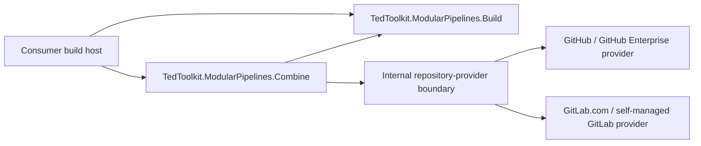

# ModularPipelines Public Package Boundaries

- Status: Approved revision
- Owner: User
- Scope and system boundary: the public NuGet packages for `TedToolkit.CodeAnalysis` and `TedToolkit.ModularPipelines*`, their consumer build hosts, and the GitHub/GitLab CI adapter layer.
- Governing principles: None; the repository does not currently contain an approved `docs/principles/`.
- Related ADR: [ADR-001](../adr/ADR-001-public-pipeline-package-boundaries.md)
- Approved revision: `be0e9b19941251498807d91088eaa4f8ea4d17a6`
- Approved revision decision: [ADR-002](../adr/ADR-002-activate-sonar-through-an-external-package-dependency.md)

## Current Architecture

The current-state evidence was inspected in `https://github.com/TedToolkit/TedToolkit.git` at commit `3ffa097c26349fdd60d1f86cc6d684e5808e2337`. `TedToolkit.ModularPipelines` is a single `net10.0` class library: `TedPipeline` creates the pipeline, registers Gemini, selects default modules, and directly references the GitHub SDK and GitHub Actions environment. Its modules also embed and write the repository's `.editorconfig` and commit-message prompt, while assuming `main`, `development`, `Directory.Build.props`, and several output directories. `TedToolkit.CodeAnalysis` is an analyzer metapackage, but consumer configuration is injected by the repository-root `props/CodeAnalysis.props` and relative `ProjectReference` entries, so it is not a stable NuGet consumption surface.

The target boundaries and dependency direction are shown below. Only three packages are published. GitHub and GitLab are two internal implementations of the same repository-provider boundary inside Combine, not separate public packages that consumers must install.



- `TedToolkit.CodeAnalysis` is a single analyzer aggregation package. It has no Strict variant or `lib` assets and does not override consumer rules. Licensed Roslynator and StyleCop analyzer/CodeFix assets are explicitly packed under their compatible `analyzers/dotnet/.../cs/` paths after license, dependency-closure, and isolated Roslyn-host validation. `SonarAnalyzer.CSharp` remains an exact external dependency and is activated only through the minimal MSBuild exception defined by ADR-002; its DLL is not copied into the TedToolkit package. Host-neutral copied assets use `analyzers/dotnet/cs/`; upstream Roslyn-versioned sets retain distinct paths such as `analyzers/dotnet/roslyn3.8/cs/` and `analyzers/dotnet/roslyn4.7/cs/`. Variants are never flattened or mixed. A required CodeFix or Sonar activation validation failure blocks the package rather than silently removing behavior.
- `TedToolkit.ModularPipelines.Build` is a platform- and AI-provider-neutral build library. It contains workspace handling, .NET commands, tests, explicit `dotnet pack`, a versioned artifact manifest, and shared `.editorconfig`, commit-message/change-request instruction, branch, and directory conventions. It cannot create PRs, MRs, or Releases and does not reference repository-hosting, Gemini, or notification SDKs.
- `TedToolkit.ModularPipelines.Combine` is the high-level orchestration library. It depends on Build and contains explicit profiles, artifact-manifest consumption, publication policies, and repository-provider selection. It is the only package containing GitHub/GitLab SDKs, but it contains no Feishu, Slack, Teams, or other notification SDK.
- Combine's internal `GitHubRepositoryProvider` and `GitLabRepositoryProvider` implement the same internal capability boundary. Calling modules work only with unified change-request and Release models, never Octokit or GitLab SDK types.
- Optional text generation is injected through Build's public `IChangeDescriptionGenerator`; optional notifications are injected through Combine's public `IPipelineEventSink`. When no implementation is registered, the capability is skipped and cannot block build, pack, or publication.
- Build and Combine may run in the same process or hand off between two CI jobs through `PipelineArtifactManifest`. The manifest record is a versioned, verifiable, secret-free file contract and does not depend on in-process objects; referenced consumer-produced artifacts remain subject to the consumer's content policy.
- GitLab instance and API URLs are consumer configuration; GitLab CI variables are only fallbacks. GitHub likewise supports GitHub Enterprise through explicit connection configuration.
- `CodeAnalysis` delivers copied analyzer assets plus one exact external Sonar dependency and its bounded activation adapter. Consumers retain their own `.editorconfig`, warning policy, and StyleCop configuration.

Reference mode is part of the boundary rather than an implementation accident. The non-packable repository `Build/Build.csproj` uses direct `ProjectReference` entries to both Build and Combine so it always executes the source revision being built and has no candidate-package bootstrap loop. Independent consumers use direct, same-version `PackageReference` entries to both packages whenever their host calls both API surfaces; they do not rely on Combine's transitive Build dependency. Package-only consumer fixtures prove the public path separately from the actual repository-host compatibility tests.

## Public Package Contracts

| Package | Capabilities obtained by the consumer | Public configuration/input | Output | Explicit non-responsibilities |
| --- | --- | --- | --- | --- |
| `TedToolkit.CodeAnalysis` | Analyzer and validated CodeFix assets plus exact external Sonar activation | `PackageReference`; the consumer's own `.editorconfig` and MSBuild properties | Compiler diagnostics and the preserved current IDE quick-fix providers | Does not write rule files, elevate warnings, provide a Strict package/runtime API, or copy the Sonar DLL; its only MSBuild assets activate and validate the exact Sonar dependency |
| `TedToolkit.ModularPipelines.Build` | Clean, format, test, build, pack, local publish archives, and artifact collection; recoverable temporary MSBuild version stamping; embedded standard `.editorconfig` plus commit/change-request instructions; standard conventions; optional neutral change-description entry point | `BuildInputs`, `BuildOptions`, named Build/Test/Pack/Publish targets, optional `TemporaryMsBuildVersionOptions`, `PipelineConventionOptions`, and explicit workspace/artifact roots | `BuildResult`, `PipelineArtifactManifest`, typed artifacts, and standard resource content | Does not create PRs, MRs, or Releases; does not stage or commit version changes; does not reference repository-hosting, AI, or notification SDKs; does not require default resources or text generation |
| `TedToolkit.ModularPipelines.Combine` | `LocalBuild`, `Validate`, `Pack`, `Publish`, and `Message` profiles; runs Build or consumes an existing artifact manifest; optional NuGet publication checkpoints, remote publication, explicit Release-only finalization, and neutral event notifications | `CombineOptions`, optional `PipelineConfigurationLoader`, `PipelineInputMode`, `RepositoryProviderKind`, `PipelineConventionOptions`, `NuGetPushOptions`, `IPackagePublicationCheckpoint`, `PublicationOptions`, provider connection options, explicit action switches, `ReleaseFinalizationOptions`, `IReleaseFinalizer`, and optional `IPipelineEventSink` | `PipelineRunResult`, `ChangeRequest`, `ReleasePublicationResult`, and `PipelineEvent` | Does not provide a fixed `Program.cs`; does not choose branches, URLs, secrets, AI, or notification channels for the consumer; does not expose SDK types in public APIs |

Combine compiles through a direct `ProjectReference` to Build. The SDK's default project-reference pack behavior emits a minimum-version dependency, so the Combine project contains one isolated pack-time target after `_GetProjectReferenceVersions`. It must find exactly the Build project-reference item and replace only that item's generated `ProjectVersion` metadata with the normalized exact range `[$(PackageVersion)]`; zero/multiple matches, an empty/unparseable version, or a generated nuspec that is not exact fails pack. The target neither changes restore/build references nor introduces a candidate-package bootstrap dependency. Because the hook is an SDK pack implementation boundary, a focused PoC and the release-contract nuspec test run against one exact .NET 10 SDK patch before implementation acceptance. After that PoC passes, a repository-root `global.json` pins that exact SDK with patch roll-forward disabled, preserving any required test-runner selection, and CI installs the same version before invoking `dotnet`. An SDK-version change requires rerunning the PoC and release-contract pack test in an approved dependency-baseline update; an incompatibility blocks packing and returns to design instead of silently degrading to an open range.

`BuildInputs` must explicitly identify the root, strict-descendant artifact root, and named Build/Test/Pack/Publish targets required by the selected profile. Working directories and artifact layout use shared conventions but may be explicitly overridden; they must not be inferred from repository name or process working directory.

## CodeAnalysis Packaging Contract

`TedToolkit.CodeAnalysis` is an analyzer aggregation package, not a rule-file distribution package. Its `.nupkg` must contain only the following asset categories:

| Asset | Requirement |
| --- | --- |
| `analyzers/dotnet/.../cs/` | Contains only the required copied Roslynator/StyleCop analyzer DLLs, the complete current copied CodeFix set, and their runtime dependencies after license, dependency-closure, and isolated Roslyn-host validation. Host-neutral assets use `analyzers/dotnet/cs/`; each audited upstream Roslyn-versioned set retains its distinct `roslyn<major>.<minor>/cs/` subtree so NuGet/SDK host selection is preserved. Same-name binaries from different variants are never flattened together; the Sonar DLL, unrelated code fixes, tools, and content files are excluded |
| NuGet dependency groups | Contain the exact `SonarAnalyzer.CSharp` range `[10.23.0.137933]`; copied analyzers have no transitive package assumption, and no dependency references a project in this repository |
| `buildTransitive/TedToolkit.CodeAnalysis.props` and `.targets` | The only permitted MSBuild assets; add the exact restored Sonar DLL as an Analyzer and fail before compilation when it is missing |
| Other `build/`, `buildTransitive/`, or `lib/` content | Forbidden; consumer rules and warning policy must not be injected through MSBuild |
| README, icon, license, and repository metadata | Present consistently in every published package; CodeAnalysis keeps the aggregation-package license separate from `THIRD-PARTY-NOTICES.txt`; only Build and Combine additionally provide symbol packages and SourceLink |

The package must not distribute or override `.editorconfig` or `stylecop.json`, and it must not create a Strict variant. Build's resource module handles shared pipeline rules; each consumer controls compiler-diagnostic severity. The CodeAnalysis fixtures must prove that copied analyzers load after referencing the package, the exact Sonar dependency restores from the controlled upstream source and is automatically registered without its DLL appearing in the TedToolkit nupkg, NuGet/SDK selects exactly one compatible Roslyn-versioned set without loading a sibling variant, every approved current CodeFix provider and its runtime closure loads in an isolated offline Roslyn host for every retained variant, and the fixture's local `.editorconfig` can set diagnostics to `none`, `warning`, or `error` without the package changing the result. If any required current CodeFix or Sonar activation path cannot be licensed, resolved, selected, or loaded, release is blocked pending revised User approval; copying Sonar, flattening variants, or partial preservation is not an implementation fallback.

Release metadata, version alignment, forbidden assets, and release-readiness gates for all three packages are governed by the [NuGet Release Contract](../changes/P2-nuget-ready-modular-pipelines/nuget-release-contract.md). Test projects and commands for behavior cases are governed by the [Testing Strategy](../changes/P2-nuget-ready-modular-pipelines/testing-strategy.md).

## Shared Standard Resources and Conventions

`TedToolkit.ModularPipelines.Build` embeds and exposes the following standard resources:

- `StandardResources.EditorConfigBase`: the `.editorconfig` baseline extracted from rules shared by both repositories. `UpdateEditorConfigModule` writes it, combined with an optional overlay, to the repository-root `.editorconfig` only when explicitly enabled by the consumer.
- `StandardResources.CommitMessagePromptBase`: language-neutral commit-message instructions extracted from shared requirements.
- `StandardResources.ChangeRequestPromptBase`: separate language-neutral PR/MR title/body instructions. It does not inherit gitmoji/commit-subject rules accidentally.
- `PipelineConventions.MainBranch = "main"` and `PipelineConventions.DevelopmentBranch = "development"`.
- `PipelineLayout` defaults to `props`, `output`, `externals`, `nuget`, `test`, `publish`, and `pipeline-artifacts.v1.json`. The manifest replaces legacy version and failure-list handoff files. Manifest entries explicitly preserve the semantic runtime-output information used by both repositories without requiring their legacy directory enumeration.
- `PipelineExecutionPolicy.Standard`: local execution maps to `LocalBuild`; CI execution on main maps to `Publish`; a publication change request from development to main and summary updates from ordinary branches to development preserve the standard workflows currently used by both repositories.

The complete resources in the two existing repositories are not byte-identical, so one must not silently overwrite the other. The shared baseline is not a TedToolkit-private resource; it is a versioned default convention of the pipeline package. Each future consumer retains only its differences from that baseline. Resource unit tests pin the baseline, overlay order, and TedToolkit's normalized expanded result. The EverythingButTheSink-derived fixture instead uses synthetic overlays to assert only the approved shared and differing semantics; it does not store that repository's complete resource text. The package README lists the resource version and change notes.

Overrides occur only through explicit configuration:

1. Load the embedded baseline.
2. Apply each configured editor, commit-message, or change-request overlay only to its matching base. Later `.editorconfig` keys override earlier keys, while instruction text is appended with the defined delimiter.
3. For any one resource, configuring both replacement and overlay is an error; a replacement suppresses that resource's base and overlay only.
4. If the consumer specifies `PipelineConventionOptions`, override `main`, `development`, or directory names.
5. When unspecified, use the embedded baselines and default constants above.
6. When `WriteEditorConfig=false` (the default), do not write a file, though the resolved resource remains readable for tests or display. Atomic writes are permitted only when it is explicitly set to `true`.

This lets users configure different repositories while TedToolkit and EverythingButTheSink retain only their own difference layers. The resolved "baseline + overlay" result can therefore preserve existing behavior.

The instruction documents are ordinary versioned resources and do not imply that Build depends on AI. Consumers may implement `IChangeDescriptionGenerator` with Gemini, OpenAI, a local model, deterministic rules, or a human workflow. The public package never reads API keys belonging to those implementations.

### Resource API and Composition Algorithm

Build must provide the following public API. These type names are implementation contracts for this change:

```csharp
public static class PipelineConventions
{
    public const string MainBranch = "main";
    public const string DevelopmentBranch = "development";
}

public static class StandardResources
{
    public const int ResourceVersion = 1;
    public static string EditorConfigBase { get; }
    public static string CommitMessagePromptBase { get; }
    public static string ChangeRequestPromptBase { get; }
}

public sealed record PipelineLayout
{
    public string PropsDirectoryName { get; init; } = "props";
    public string OutputDirectoryName { get; init; } = "output";
    public string ExternalsDirectoryName { get; init; } = "externals";
    public string NuGetDirectoryName { get; init; } = "nuget";
    public string TestDirectoryName { get; init; } = "test";
    public string PublishDirectoryName { get; init; } = "publish";
    public string ManifestFileName { get; init; } = "pipeline-artifacts.v1.json";

    public static PipelineLayout Standard { get; } = new();
}

public sealed record PipelineConventionOptions
{
    public string MainBranch { get; init; } = PipelineConventions.MainBranch;
    public string DevelopmentBranch { get; init; } = PipelineConventions.DevelopmentBranch;
    public string GitRemoteName { get; init; } = "origin";
    public PipelineLayout Layout { get; init; } = PipelineLayout.Standard;
}

public sealed record EmbeddedResourceOptions
{
    public string? EditorConfigOverlayPath { get; init; }
    public string? EditorConfigReplacementPath { get; init; }
    public string? CommitMessageOverlayPath { get; init; }
    public string? CommitMessageReplacementPath { get; init; }
    public string? ChangeRequestOverlayPath { get; init; }
    public string? ChangeRequestReplacementPath { get; init; }
    public bool WriteEditorConfig { get; init; }
}

public enum ChangeDescriptionFailureMode { Continue, FailPipeline }

public sealed record BuildOptions
{
    public PipelineConventionOptions Conventions { get; init; } = new();
    public EmbeddedResourceOptions Resources { get; init; } = new();
    public bool RunFormat { get; init; }
    public bool GenerateChangeDescriptions { get; init; }
    public int MaxDegreeOfParallelism { get; init; }
        = Math.Max(1, Math.Min(Environment.ProcessorCount, 4));
    public ChangeDescriptionFailureMode ChangeDescriptionFailureMode { get; init; }
        = ChangeDescriptionFailureMode.Continue;
}

public enum BuildExecutionProfile
{
    LocalBuild,
    Validate,
    Pack,
    Publish,
    Message,
}

public static class BuildPipelineExtensions
{
    public static PipelineBuilder AddBuildPipeline(
        this PipelineBuilder builder,
        BuildExecutionProfile profile,
        BuildInputs inputs,
        BuildOptions? options = null)
    {
        // Validation and fixed-graph registration are the package implementation.
        return builder;
    }
}
```

`AddBuildPipeline` is the Build-only public composition entry point. It returns the same builder after validating and registering the fixed Build graph for the selected profile; it neither requires nor references Combine. `Publish` in this Build enum means local pack/`dotnet publish` production only and never authorizes a remote action. Combine maps its five active same-named profiles one-to-one to this enum and makes no Build call for `None`.

The `.editorconfig` composition rule is: if a replacement exists, use only it; otherwise use `EditorConfigBase + "\n" + overlay`. Instruction documents independently use `Replacement > Base + append-only overlay > Base`, with a single normalized blank-line delimiter. Commit instructions contain formatting, gitmoji, type, body, and breaking-change rules; change-request instructions contain title/body/summary rules without commit-only constraints. Language, tone, ticket syntax, and repository-specific differences belong only in the matching replacement/overlay; there is no language switch. Inputs must be valid UTF-8, NUL-free, and at most 1 MiB each; output is UTF-8 without BOM, LF-normalized, and has exactly one final newline. Every resolved document reports `StandardResources.ResourceVersion`; any embedded-base content change increments it and is listed in the package README. Resource reading, composition, hashing, and same-directory atomic writing are independently testable services; modules only call those services. Main/development are validated Git branch names. `GitRemoteName` is non-empty and control/whitespace-free, and the composed `refs/remotes/{GitRemoteName}/placeholder` must pass `git check-ref-format`; no name is interpolated into a shell command. `RunFormat=false` is the safe default; LocalBuild formats only when enabled.

The public resource service contract is:

```csharp
public enum PipelineResourceSource
{
    EmbeddedBase,
    EmbeddedBaseWithOverlay,
    Replacement,
}

public sealed record PipelineResourceDocument(
    string Content,
    int ResourceVersion,
    string Sha256,
    PipelineResourceSource Source);

public sealed record PipelineResourceWriteResult(
    PipelineResourceDocument Document,
    FileInfo TargetFile,
    bool Written);

public interface IPipelineResourceComposer
{
    Task<PipelineResourceDocument> GetEditorConfigAsync(
        DirectoryInfo rootDirectory,
        EmbeddedResourceOptions options,
        CancellationToken cancellationToken);

    Task<PipelineResourceDocument> GetCommitMessageInstructionsAsync(
        DirectoryInfo rootDirectory,
        EmbeddedResourceOptions options,
        CancellationToken cancellationToken);

    Task<PipelineResourceDocument> GetChangeRequestInstructionsAsync(
        DirectoryInfo rootDirectory,
        EmbeddedResourceOptions options,
        CancellationToken cancellationToken);

    Task<PipelineResourceWriteResult> WriteEditorConfigAsync(
        DirectoryInfo rootDirectory,
        EmbeddedResourceOptions options,
        CancellationToken cancellationToken);
}
```

### Neutral Change-Description Contract

Build exposes the following provider-neutral models. The interface must not reference types from `Microsoft.Extensions.AI`, Gemini, OpenAI, or any other model SDK:

```csharp
public enum ChangeDescriptionKind { CommitMessage, ChangeRequest }

public sealed record ChangeDescriptionRequest(
    ChangeDescriptionKind Kind,
    string Diff,
    bool DiffTruncated,
    IReadOnlyList<string> ChangedFiles,
    string Instructions);

public sealed record ChangeDescription(string Subject, string Body);

public interface IChangeDescriptionGenerator
{
    Task<ChangeDescription?> GenerateAsync(
        ChangeDescriptionRequest request,
        CancellationToken cancellationToken);
}
```

The interface is optional capability, not a required service. Registration alone never authorizes generation. Build's commit-message module and Combine's change-request summary module invoke it only when `GenerateChangeDescriptions=true`, the active profile permits generation, and an implementation is registered. A LocalBuild commit-message request uses the tracked staged-and-unstaged diff against `HEAD`; untracked paths are listed but their contents are not read. A Message change-request request uses the local merge-base diff from `refs/remotes/{GitRemoteName}/{routed target branch}` to the exact source revision. The target ref and required history must already exist; the package never fetches. A missing/ambiguous ref or insufficient history is a generator failure handled by `ChangeDescriptionFailureMode`, so the default `Continue` still uses deterministic change-request fallback content. Git is invoked without external diff drivers/text conversion; binary changes contribute paths but not binary content. Changed paths are normalized repository-relative values. Diff text is UTF-8, truncated only at a line boundary to at most 1 MiB, and marks `DiffTruncated=true`; no diff plus no changed file is a normal skip. Enabling generation explicitly authorizes passing this request to the consumer implementation, which owns any external data-transfer policy. The modules skip safely when the interface is absent, returns `null`, or declines. A returned subject is trimmed, single-line, control-character-free, and 1–256 characters; body text is LF-normalized, NUL-free, and at most 64 KiB UTF-8. Invalid output is a generator failure: `Continue` uses the deterministic fallback/skip, while `FailPipeline` fails. They must not create model clients, read model secrets, select a provider, copy text to a clipboard, or log a diff, prompt, or generated output. `BuildOptions.ChangeDescriptionFailureMode` defaults to `Continue`; an absent generator or a `null` result is always a normal skip. Concrete model secrets, persistence, display, and clipboard behavior remain entirely consumer-owned.

## Cross-Job Artifact Contract

After any `Validate`, `Pack`, or `Publish` Build graph starts, `WriteArtifactManifestModule` must run exactly once as the final Build module, including after a command failure. Combine may consume `BuildResult` directly in the same process or read the manifest in another CI job. Schema v1 is an exact integer contract:

```csharp
public enum PipelineArtifactKind
{
    NuGetPackage,
    SymbolPackage,
    PublishArchive,
    TestResult,
    FailureLog,
}

public enum PipelineRunStatus { Running, Succeeded, Failed }

public sealed record PipelineArtifact(
    string Path,
    PipelineArtifactKind Kind,
    string LogicalName,
    string Sha256,
    long Size,
    string? PackageId = null,
    string? PackageVersion = null,
    string? RuntimeIdentifier = null,
    string? TargetFramework = null);

public sealed record TargetExecutionResult(
    string Name,
    string Configuration,
    bool Succeeded,
    int ExitCode,
    string? FailureLogPath);

public sealed record TestExecutionResult(
    string Name,
    DotNetTestCommand Command,
    string Configuration,
    bool Succeeded,
    int Total,
    int Passed,
    int Failed,
    int Skipped,
    IReadOnlyList<string> ResultPaths);

public sealed record PipelineFailure(
    string Code,
    string Stage,
    string Summary);

public sealed record BuildResult(
    PipelineRunStatus Status,
    IReadOnlyList<TargetExecutionResult> Targets,
    IReadOnlyList<TestExecutionResult> Tests,
    IReadOnlyList<PipelineArtifact> Artifacts,
    IReadOnlyList<PipelineFailure> Failures,
    ChangeDescription? GeneratedDescription);

public sealed record PipelineArtifactManifest(
    int SchemaVersion,
    PipelineRunStatus Status,
    string? SourceRevision,
    bool SourceTreeDirty,
    DateTimeOffset CreatedAtUtc,
    string? PackageVersion,
    IReadOnlyList<PipelineArtifact> Artifacts,
    IReadOnlyList<TargetExecutionResult> Targets,
    IReadOnlyList<TestExecutionResult> Tests,
    IReadOnlyList<PipelineFailure> Failures);

public interface IPipelineArtifactManifestReader
{
    Task<PipelineArtifactManifest> ReadAsync(
        DirectoryInfo consumerRoot,
        FileInfo manifestFile,
        ArtifactValidationOptions options,
        CancellationToken cancellationToken);
}

public interface IPipelineArtifactManifestWriter
{
    Task<FileInfo> WriteAsync(
        DirectoryInfo artifactRoot,
        string manifestFileName,
        PipelineArtifactManifest manifest,
        CancellationToken cancellationToken);
}
```

`SchemaVersion` must equal `1`; every other value is rejected. JSON is UTF-8 without BOM, camelCase, uses string enum names, ISO-8601 UTC timestamps, lowercase 64-character SHA-256 values, nonnegative sizes/counters, non-null collections, and deterministic kind/path ordering. Readers reject duplicate or unknown properties, unknown enum names, trailing content, and inconsistent totals. `PipelineLayout` directory properties and `ManifestFileName` are portable single path segments of 1–128 characters, not paths; names are distinct under ordinal-ignore-case comparison and reject controls, `/`, `\`, `:`, `*`, `?`, `"`, `<`, `>`, `|`, `.`/`..`, and a trailing dot or space. The manifest name must end in `.json`. Build writes the manifest directly under `ArtifactRootDirectory` using that filename. Writers use create-new temporary files plus atomic replacement within the validated artifact root and leave no accepted partial manifest. In `ConsumeArtifacts`, the resolved manifest path must be a regular non-link file at or below the explicit consumer root; its parent directory, which may equal that consumer root, is the artifact root used for every relative entry. A persisted status is only `Succeeded` or `Failed`; `Running` is valid only for an in-process `PipelineRunResult`. Artifact paths use `/`, are relative to the configured artifact root, and cannot be empty, rooted, drive-qualified, UNC, contain `.` or `..` segments, or escape through a symbolic link/reparse point. Every file must exist and match its recorded SHA-256 and size. Package ID and normalized package version are read from the package nuspec, never parsed from the filename. Multi-RID and multi-TFM outputs are separate entries. The manifest must not contain absolute paths, tokens, Authorization headers, URL query values, environment-variable snapshots, machine usernames, diffs, prompts, or generated descriptions; `BuildResult.GeneratedDescription` is same-process-only.

Artifact LogicalName is package ID for NuGet/Symbol packages, `DotnetPublishTarget.ArtifactName` for publish archives, TestTarget name for test results, and target/stage name for failure logs. Optional metadata that does not apply to a kind must be null; readers reject contradictory kind/metadata combinations.

FailureLog artifacts are package-authored UTF-8 diagnostics of at most 64 KiB containing only safe target/stage, command kind, exit/timeout/cancellation state, and redacted summary fields. They never copy raw process output, exception text/stack traces, environment values, arguments containing a credential, prompts, diffs, or generated content. Consumer command output remains subject to the consumer runner's own log policy and is not persisted into the artifact handoff by Build.

Relational validation is also strict: every result path references exactly one artifact of the corresponding kind; artifact and archive-entry paths are unique under conservative ordinal-ignore-case comparison; test totals equal passed + failed + skipped; `Succeeded` requires every target/test to succeed and `Failures` to be empty; `Failed` requires at least one failed result or failure; every recorded failure-log path references a FailureLog artifact; and `PackageVersion` is empty exactly when there is no NuGetPackage artifact, otherwise it equals every nupkg nuspec version. SymbolPackage entries must match a primary package identity.

Except for the manifest file itself, every regular file under the artifact root must have exactly one artifact entry; readers reject unlisted files. Auxiliary files created inside a test target's isolated result directory are recorded as TestResult artifacts, while `TestExecutionResult.ResultPaths` identifies only parsed TRX files. Temporary files and raw publish directories are removed before the atomic manifest is committed; an unclassifiable residual file fails the run.

Every `PackTarget.PackageVersion` is parsed with `NuGet.Versioning.NuGetVersion` and stored through `ToNormalizedString()`. All pack targets in one run must normalize to the same value; mixed versions are rejected before commands execute. After pack, each nupkg nuspec version must match that normalized input, package IDs and paths must each be unique under ordinal-ignore-case comparison, and a symbol package must match a primary package identity. The case-insensitive ID rule prevents both NuGet identity ambiguity and collisions when a consumer maps IDs into a lowercase checkpoint key. TedToolkit coordinates CodeAnalysis, Build, and Combine under one release version so its repository host can validate all three through one manifest. Other consumers may run unrelated package families separately, but one manifest never mixes versions.

Build's optional `DailyReleaseVersionPolicy` is pure and platform-neutral. It accepts one `DailyReleaseVersionRequest` containing an explicit caller-selected `DateOnly`, the current source revision, caller-supplied neutral consumed-version records, and a Boolean indicating whether an active publication reservation exists. Provider-owned manifest hashes, CI run identities, tag annotations, and recovery evidence are parsed and validated before this boundary and never enter Build's public versioning API. The policy never chooses a clock or time zone. TedToolkit supplies the runner-local calendar date to preserve the current `DateTime.Today` behavior; another consumer may deliberately supply UTC or a business-zone date. Recognized consumed versions use NuGet-normalized `yyyy.M.d` for counter zero or `yyyy.M.d.<counter>` for a positive counter. With no active reservation, the policy returns counter zero when the date has no consumed record or one more than that date's highest consumed counter, even when the current revision was released before. The counter is limited to `0..65534` so the same numeric value is always legal in `AssemblyVersion` and `AssemblyFileVersion`; exhaustion fails before any Build command. An `Abandoned` record consumes its unsafe/partial version but does not represent package success. An active reservation returns `PublicationRecoveryRequired` and no buildable version: a new Build run never reconstructs or overwrites an artifact set reserved by a previous publication attempt. Unrelated tags are filtered by the host; duplicate/conflicting recognized records fail. A checked-in non-secret `Build/release-history.v1.json` pins the normalized package-version/exact legacy tag-name/target mappings that were GitHub Releases before cutover; the host verifies those mappings against fetched tags and maps only normalized version/target/disposition to `PackageSucceeded` records. After cutover, only schema-valid automation-owned package-success and abandoned tags are mapped to consumed records. The policy never reads environment variables, calls a provider, or touches the filesystem. Consumers may instead supply any valid explicit package version.

The exact public calculation entry point is `ReleaseVersionResolution DailyReleaseVersionPolicy.Resolve(DailyReleaseVersionRequest request)`. Temporary transaction and recovery-state implementations are internal Build services reached through `AddBuildPipeline`; `TemporaryMsBuildVersionOptions` is public configuration, but no lock or recovery-file implementation type becomes a public API.

P2-NUPIPE-003 creates that baseline once through a non-packable migration command using the repository's already-present GitHub client boundary and a read-only built-in credential; this introduces no candidate P2-NUPIPE-004 dependency. It exhausts the paginated GitHub Release query, ignores unrelated tag namespaces, and accepts every non-draft Release whose exact tag is a canonical legacy calendar value: `yyyy.M.d`, `yyyy.M.d.0`, or `yyyy.M.d.<positive-counter>` without leading-zero components. Capture preserves that exact `tagName`, maps `.0` and the three-component form to normalized package `version=yyyy.M.d`, and verifies each accepted tag's peeled target against complete local history. A draft using the reserved calendar namespace, a calendar-like but noncanonical/malformed tag, duplicate normalized version or tag name, missing/moving tag, or target conflict fails capture. Completion evidence records UTC query time, repository identity, page/total/accepted/ignored counts, existing tool/client version, generated-file SHA-256, and secret-free comparison results; it excludes credentials and raw authenticated responses. User acceptance cites the implementation commit containing those exact bytes/hash, after which the capture command is removed or made unreachable. Schema and generation rules are design-approved, while the accepted generated bytes become immutable operational history. Any later correction requires a separately approved audited data-correction change. Runtime never repeats the API query. Selecting the highest validated consumed counter deliberately replaces legacy `releases[0]`: normal monotonic history is equivalent, while provider-order, out-of-order, or conflicting history cannot silently select a reused version.

```csharp
public enum ConsumedReleaseDisposition
{
    PackageSucceeded,
    Abandoned,
}

public sealed record ConsumedReleaseVersionRecord(
    string Version,
    string TargetRevision,
    ConsumedReleaseDisposition Disposition);

public sealed record DailyReleaseVersionRequest(
    DateOnly ReleaseDate,
    string SourceRevision,
    IReadOnlyList<ConsumedReleaseVersionRecord> ConsumedVersions,
    bool HasActivePublicationReservation);

public enum ReleaseVersionResolutionKind
{
    NewVersion,
    PublicationRecoveryRequired,
}

public sealed record ReleaseVersionResolution(
    ReleaseVersionResolutionKind Kind,
    string? Version);

public sealed record TemporaryMsBuildVersionOptions(
    FileInfo File,
    string PropertyName,
    FileInfo RecoveryFile,
    string? TargetVersion);
```

`TemporaryMsBuildVersionTransaction` is a separate provider-neutral Build service for consumers whose compiled outputs must receive an explicit version through an MSBuild property file. `BuildInputs.MsBuildVersion` names one regular root-contained XML file, the `Version` property, an optional normalized target version, and a root-contained recovery file outside the artifact root; TedToolkit supplies these recovery paths for every active `RunBuild` profile, supplies no target version for LocalBuild/Validate/Message, and supplies `TargetVersion` only for Pack or Publish. None invokes no Build input or recovery; because it also runs no producer, the next active profile remains responsible for recovery. The service rejects links/reparse points, a missing or duplicate property, malformed XML, mismatched `PackTarget` versions, and a recovery path outside the repository root or inside the artifact root. Recovery is always the first in-process host operation, before artifact cleanup and every pipeline-owned SDK producer. When `TargetVersion` is absent, recovery still runs but no new transaction begins. For Pack or Publish, after `CleanOutputModule`, `BeginAsync` atomically creates the recovery file and holds an exclusive file lock for the transaction lifetime. The file contains the target's repository-relative path, original bytes and SHA-256, and expected temporary SHA-256. Build then atomically replaces only the target file with the temporary value. A concurrent invocation that cannot acquire the lock fails without recovery or mutation; after abrupt process termination the OS releases the lock so a later invocation can recover. The recovery file is never logged, packed, copied to the artifact root, or uploaded.

The outer `dotnet run --project Build/Build.csproj` launcher may evaluate and compile the non-packable host before application recovery code can run. This bootstrap compilation is an explicit compatibility exception: `Build.csproj` is `IsPackable=false`, creates no package or remote side effect, and none of its outer-build outputs may enter the manifest. After startup recovery, the host runs the declared clean/build targets again, and only those pipeline-owned outputs may be tested, packed, or published. A conflicting recovery state exits before artifact cleanup or any nested SDK command.

Pipeline-owned SDK clean/build/test/pack producers execute while the transaction is active. For normalized package version `yyyy.M.d`, `AssemblyVersion` and `AssemblyFileVersion` must be `yyyy.M.d.0`; for `yyyy.M.d.<counter>`, both must equal that four-component numeric version. `AssemblyInformationalVersion` must have the normalized package version as its SemVer core; SDK-added build metadata is allowed only when it encodes the validated source revision. Build and Combine assemblies are inspected under this mapping. CodeAnalysis has no package-owned compiled assembly and is validated through its nuspec version.

`RestoreAsync` runs as mandatory cleanup after all pipeline-owned SDK producers and before `WriteArtifactManifestModule`, including handled command failure and cancellation. It restores the exact original bytes, verifies the original hash, and removes the recovery file. If restoration or verification fails, the Build result is Failed and remote mutation is forbidden. At in-process host start, recovery is checked before artifact cleanup: surviving state is applied only when the current target hash equals the recorded temporary hash; an already-restored original hash only removes stale recovery state; any third state fails without overwriting the file. Abrupt process or runner termination therefore may leave the temporary bytes briefly on disk, but cannot silently lose the original or publish from an unverified state. The service exposes no Git operation, and the host/workflow must never stage, commit, or push the temporary difference. The TedToolkit host's exact recovery path is anchored in the root `.gitignore` as `/.tedtoolkit-release-version.recovery`; a release-contract test uses `git check-ignore` and fails if the rule disappears or matches a broader path than intended.

The calendar, `nuget-pending/`, `nuget-package/`, and `nuget-abandoned/` tag shapes are an automation-reserved namespace. After cutover, a package-success calendar tag is annotated with exact LF-delimited fields `tedtoolkit-nuget-success-v1`, `manifest-sha256=<lowercase-sha256>`, and `run-identity=github:<GITHUB_RUN_ID>`. It may be created only after all expected immutable package-progress markers validate; it does not by itself prove that the required repository Release was finalized, so pending remains until that finalization completes. A pending tag uses the same latter fields under header `tedtoolkit-nuget-pending-v1`; the stable run ID owns the original artifact across retry attempts. After one package command returns confirmed success with `SkipDuplicate=false`, the host creates immutable annotated `nuget-package/<version>/<lowercase-package-id>` at the same source revision. The lowercase tag segment is the exact manifest/nuspec PackageId converted with `ToLowerInvariant()` and must pass Git ref-format validation before any push. Its exact LF-delimited fields are `tedtoolkit-nuget-package-v1`, `package-id=<exact-nuspec-id>`, `package-sha256=<lowercase-sha256>`, `symbol-sha256=<lowercase-sha256-or-none>`, `manifest-sha256=<lowercase-sha256>`, and the matching `run-identity=...`. A retry validates and skips matching marked packages and pushes only unmarked packages, still with `SkipDuplicate=false`. A progress marker is valid only when at least one matching lifecycle anchor exists: active pending, package success, or abandoned. Pending alone permits an in-progress subset; success or abandoned preserves evidence after pending cleanup; pending plus success/abandoned is the corresponding interrupted cleanup state. Package success and abandoned are mutually exclusive. Before creating pending, the publication job evaluates the existing state for that exact version: package-success without pending is already completed and returns success with no mutation; abandoned without pending is already abandoned and returns its non-success recovery outcome with no mutation. The two audited recovery actions use the same terminal no-op behavior, so retrying a completed cleanup never recreates pending or calls a provider. Unknown, missing, or duplicate fields, unexpected/duplicate/case-conflicting package IDs, an invalid lowercase ref segment, mismatched hashes/targets, a progress marker with no matching lifecycle anchor, both success and abandoned, or a duplicate/uncertain result for an unmarked package fail. An unmarked duplicate is never remote-byte proof and authorizes no marker. If the original artifact cannot be recovered before a package-success marker exists, or an unmarked package result is unverifiable, an explicitly audited operator procedure first creates immutable annotated `nuget-abandoned/<version>` at the same revision with `tedtoolkit-nuget-abandoned-v1`, copied manifest/run fields, and an opaque audit ID matching `[A-Za-z0-9][A-Za-z0-9._-]{0,127}` with no credential or URL, and only then deletes pending. Existing valid progress markers remain immutable partial-publication evidence. If interruption leaves matching abandoned plus pending, rerunning the procedure validates every copied field and performs pending-deletion cleanup only; publication recovery must not push that version. Abandonment is forbidden after package success, when Release finalization is required. Abandoned consumes that calendar counter, authorizes no package/Release success, and allows the next build to increment safely. Pre-cutover package-success records are recognized only through the immutable baseline file. Release automation never moves or force-pushes package-progress, package-success, or abandoned tags. Manual lifecycle-tag mutation outside the explicitly specified abandonment and finalization procedures is forbidden.

`nuget-finalized/<version>` is an additional reserved, immutable audit marker used only by the manually dispatched `FinalizeRelease` recovery action; this finalization procedure and abandonment are the only permitted manual lifecycle-tag mutation procedures. Normal successful publication does not create it and version resolution does not treat it as another consumed version. After the finalizer has idempotently proved or created the required Release, but before pending deletion, the host creates or validates this annotated tag at the same source revision with exact LF-delimited fields `tedtoolkit-nuget-finalized-v1`, the package-success tag's `manifest-sha256=...` and original `run-identity=...`, `recovery-run-identity=github:<marker-creating-recovery-run-id>`, and `audit-reference=<opaque-id>`. Missing, unknown, duplicate, mismatching, or unsafe fields fail without deleting pending. A later cleanup retry has a different current run ID: it preserves and validates the original marker-creating recovery identity rather than comparing it with or replacing it by the current ID, while its supplied audit reference must match the marker exactly. Finalized without matching package success, or finalized together with abandoned, is a conflict. Matching finalized plus package-success plus pending is an interrupted-cleanup state that deletes pending without another provider call; finalized plus package-success without pending is a terminal audited recovery state. The marker is created after Release success, so a hard termination before marker creation safely retries the idempotent finalizer, while termination after marker creation safely retries only pending cleanup. Neither package-success nor finalized is ever moved or force-pushed.

```csharp
public sealed record ArtifactValidationOptions
{
    public string? ExpectedSourceRevision { get; init; }
    public bool AllowSourceRevisionMismatch { get; init; }
}
```

`SourceTreeDirty` is captured at manifest time using NUL-delimited Git status including staged, unstaged, untracked, and submodule changes. Tracked changes are never excluded; only untracked entries inside the validated artifact root are ignored. When `ExpectedSourceRevision` is absent, the reader uses the current Git revision when available. If neither side has a revision, validation can proceed for local reporting without a revision comparison. A non-empty mismatch fails by default and is allowed only through the explicit option. `ConsumeArtifacts` may structurally validate a failed or dirty manifest so it can return/notify faithfully, but every remote mutation requires `Status=Succeeded`, non-empty SourceRevision, `SourceTreeDirty=false`, and no failed build/test target. There is no dirty-source bypass in v1.

Hashes detect corruption after manifest creation; they do not authenticate a manifest that an attacker can replace together with its files or classify referenced content as safe. Cross-job consumers must use an access-controlled CI artifact channel from the same trusted pipeline. TestResult artifacts can contain consumer test output, and PublishArchive/NuGetPackage content is consumer-owned; consumers must not place secrets in those outputs. Combine never selects TestResult or FailureLog for remote publication, and the explicit publication switches authorize only the typed package/archive artifacts. Manifest signing, content-malware/secret scanning, and untrusted artifact exchange are outside schema v1 and require consumer policy or a later design.

## Build Project and Module Boundaries

The source code of `TedToolkit.ModularPipelines.Build` is divided by the following responsibilities rather than copied according to current repository file locations:

| Area | Public surface | Responsibility | Forbidden dependencies |
| --- | --- | --- | --- |
| `Resources` | `StandardResources`, resource-composition service, options | Read and write shared resources | GitHub, GitLab |
| `Conventions` | `PipelineConventions`, `PipelineLayout`, execution policy | Defaults for main/development, directories, and execution modes | Repository names, project IDs |
| `Inputs` | `BuildInputs`, `BuildOptions`, `PackTarget`, `DotnetPublishTarget`, `BuildResult` | Consumer descriptions and results for solution/project/test/pack/local publish | Fixed solution files, mandatory Git worktrees |
| `Artifacts` | `PipelineArtifactManifest`, `IPipelineArtifactManifestReader`, `IPipelineArtifactManifestWriter`, hash validator | Artifact handoff in process and across CI jobs | Absolute paths, secrets, provider types |
| `Versioning` | `DailyReleaseVersionPolicy`, `DailyReleaseVersionRequest`, `ConsumedReleaseVersionRecord`, `ConsumedReleaseDisposition`, `TemporaryMsBuildVersionOptions`; internal transaction/recovery services | Resolve a caller-dated provider-neutral release version, count package-success/abandoned consumed versions, stop new builds during active publication recovery, and, when explicitly enabled, apply a version to SDK builds through a recoverable scoped file transaction | Clock/time-zone selection, provider queries, tag/CI metadata parsing, staging, commits, pushes |
| `Modules` | `CleanStageModule<T>`, `PrepareStageModule<T>`, `CompileStageModule<T>`, `CheckStageModule<T>`, and standard modules | Organize clean/format/test/build/pack/local artifact collection | Hosting-platform, AI, and notification SDKs |
| `Descriptions` | `IChangeDescriptionGenerator`, request/result models, `GenerateCommitMessageModule` | Optional entry point for commit and change descriptions | Gemini, OpenAI, or another concrete model SDK |

The input contract is explicit and filesystem-safe:

```csharp
public enum DotNetTestCommand
{
    MicrosoftTestingPlatformRun,
    MicrosoftTestingPlatformTest,
    VSTest,
}

public enum FormatScope
{
    WorkingTreeTracked,
    HeadTracked,
    All,
}

public sealed record BuildInputs
{
    public required DirectoryInfo RootDirectory { get; init; }
    public required DirectoryInfo ArtifactRootDirectory { get; init; }
    public TemporaryMsBuildVersionOptions? MsBuildVersion { get; init; }
    public FormatTarget? FormatTarget { get; init; }
    public IReadOnlyList<BuildTarget> BuildTargets { get; init; } = [];
    public IReadOnlyList<TestTarget> TestTargets { get; init; } = [];
    public IReadOnlyList<PackTarget> PackTargets { get; init; } = [];
    public IReadOnlyList<DotnetPublishTarget> PublishTargets { get; init; } = [];
}

public sealed record FormatTarget(
    FileInfo File,
    FormatScope Scope = FormatScope.HeadTracked,
    IReadOnlyList<string>? Arguments = null,
    TimeSpan? Timeout = null);

public sealed record BuildTarget(
    string Name,
    FileInfo File,
    string Configuration = "Release",
    bool CleanBeforeBuild = false,
    IReadOnlyList<string>? Arguments = null,
    TimeSpan? Timeout = null);

public sealed record TestTarget(
    string Name,
    FileInfo File,
    DotNetTestCommand Command,
    string Configuration = "Release",
    IReadOnlyList<string>? CommandArguments = null,
    IReadOnlyList<string>? RunnerArguments = null,
    TimeSpan? Timeout = null);

public sealed record PackTarget(
    string Name,
    FileInfo File,
    string PackageVersion,
    string Configuration = "Release",
    IReadOnlyList<string>? Arguments = null,
    TimeSpan? Timeout = null);

public sealed record DotnetPublishTarget(
    string Name,
    string ArtifactName,
    FileInfo File,
    string Configuration = "Release",
    string? Framework = null,
    string? RuntimeIdentifier = null,
    bool? SelfContained = null,
    IReadOnlyList<string>? Arguments = null,
    TimeSpan? Timeout = null);
```

Every target list uses unique, non-empty names. `RootDirectory` is absolute. Direct code-model `FileInfo`/`DirectoryInfo` values must be absolute; configuration strings may be relative and are resolved against the explicit root supplied to the composition entry point, never process current directory. Every target and resource file must resolve inside `RootDirectory`. `ArtifactRootDirectory` must be a strict descendant of the root and must not equal it. Validation resolves existing path components and rejects symbolic-link/reparse-point escapes. `CleanOutputModule` may delete only that validated artifact root. Additional arguments are structured tokens and cannot repeat or override package-owned configuration, output, version, framework, runtime, self-contained, logger, or result-directory switches. Validation recognizes short/long, slash, case, and `name=value` forms; response-file tokens and consumer-supplied command separators are rejected, and only the package inserts the test-runner separator. All commands receive explicit working directories; no target path or branch is inferred from process state, and no branch or path value is interpolated into a shell command.

Target timeout is optional; when supplied it must be from one second through 24 hours. Timeout/cancellation terminates the complete child process tree on supported platforms, waits for exit, records a safe failure, and schedules no dependent producer. Failure to terminate is itself reported and still cannot authorize remote actions.

Targets within one producer module use bounded parallelism from `BuildOptions.MaxDegreeOfParallelism`, which must be positive and defaults to `max(1, min(processor count, 4))`. Results and manifest entries are reordered deterministically by declared target order and artifact kind/path, independent of completion order. Stage dependencies remain sequential, and remote mutations are never parallelized by this Build option.

`MicrosoftTestingPlatformRun` executes through `dotnet run`, then passes result-directory/TRX/filename plus `RunnerArguments` after the application separator. `MicrosoftTestingPlatformTest` requires a root-contained .NET 10 `global.json` selecting `Microsoft.Testing.Platform`; it places `--project` and `--results-directory` before `--`, then TRX/filename and runner arguments after it. `VSTest` requires no effective runner selection or a root-contained `VSTest` selection, uses `dotnet test --logger "trx;LogFileName=..." --results-directory`, and forbids `RunnerArguments`; its extra switches belong in `CommandArguments`. A `global.json` outside the explicit root cannot silently select the runner. Selection is validated before execution. This supports the current TUnit executable and conventional VSTest shapes without pretending their CLIs are identical. Each target gets a clean, unique result directory and may yield one or more fresh TRX files. A nonzero exit code, zero fresh TRX files, malformed TRX, or zero executed tests is failure; consumers that intentionally have no tests omit the target. Existing stale TRX files must never be selected by timestamp. TRX `Passed` counts as passed; `NotExecuted` or `Inconclusive` counts as skipped; every other outcome counts as failed. Counters across fresh files are aggregated into `TestExecutionResult`.

`RunFormat=true` requires `FormatTarget`. It runs `dotnet format` against that explicit solution/project. `HeadTracked` is the general default and gets NUL-delimited staged or unstaged tracked paths changed against `HEAD`; `WorkingTreeTracked` reproduces the current TedToolkit Build host by selecting only unstaged tracked paths from the index-to-working-tree diff; `All` formats the complete target. Git access is local-only. Path-based scopes retain only regular `.cs`/`.vb` files inside the root and pass them through structured `--include` arguments; no changes is a successful skip, and untracked files are deliberately excluded. Format arguments cannot override target/include ownership, and timeout follows the common target rules.

For a `BuildTarget` with `CleanBeforeBuild=true`, the package runs `dotnet clean` for the same explicit file/configuration immediately before `dotnet build`; a failed clean records the target failure and suppresses that build. The default is false so consumers do not pay for a second clean after artifact-root cleanup unless their compatibility or reproducibility policy requires it. The TedToolkit Build host explicitly sets it to true.

The standard module order is fixed as `Recover → Clean → Prepare → Compile → Check`. Within that graph, interrupted-version recovery is active for every configured `RunBuild` profile and precedes artifact cleanup; optional temporary MSBuild version application follows artifact cleanup and precedes every pipeline-owned SDK producer; Test follows Compile; Assert follows all Build/Test results; Pack and `DotnetPublishModule` run only after Assert succeeds; `CollectPublishArtifactsModule` follows all local pack/publish producers; mandatory version restoration follows the last SDK producer on both success and failure paths; and `WriteArtifactManifestModule` always runs last after restoration has been attempted. After the manifest is written, a failed build result becomes the terminal pipeline failure. Cooperative cancellation stops new work, records a safe `Cancelled` failure, and attempts version restoration plus the final Failed manifest with a separate 30-second cleanup token; abrupt process/runner termination is the only case where immediate restoration or a final manifest cannot be guaranteed, so the next configured host invocation performs in-process recovery before cleanup. This ordering prevents failed build/test runs from publishing while preserving verifiable failure evidence. `DotnetBuildModule` passes package-owned `GeneratePackageOnBuild=false`; extra arguments cannot override it. `DotnetPackModule` executes explicit `dotnet pack -c Release` and is the only package-owned producer of NuGetPackage artifacts. `DotnetPublishModule` creates one archive for every declared target. `ArtifactName` is a non-path logical identifier matching `[A-Za-z0-9][A-Za-z0-9._-]*`, excluding `.` and `..`; archive filenames are deterministically composed from that name plus explicit RID/TFM, and collisions fail before publish. Each archive must contain at least one regular file; entries reject link/reparse escapes, use normalized relative `/` names in ordinal order, fixed `1980-01-01T00:00:00Z` ZIP timestamps, and `Optimal` compression; creation is temporary-plus-atomic. A runtime identifier requires an explicit `SelfContained` value. Build changes a version file only through the explicitly enabled temporary transaction and must restore it byte-for-byte before manifest acceptance; Combine never changes it. Build does not contain package pushes, PRs/MRs, Releases, or concrete notification delivery.

Ordinary built-in repository-writing behavior (`RunFormat`, `WriteEditorConfig`) is compatible only with `LocalBuild`; enabling it in `Validate`, `Pack`, `Publish`, or `Message` is an early configuration error rather than a silent skip. MSBuild-version recovery configuration is required for every active `RunBuild` profile; LocalBuild/Validate/Message use a null target version, while a non-null target version and new transaction are permitted only for Pack or Publish and must restore before the manifest. Consumer Prepare extensions that write repository files are trusted, explicit scope expansions and may be registered only for named profiles chosen by the consumer; `ConsumeArtifacts` rejects every Build-stage extension. `None` invokes no consumer callback, sink, module, Build input, or recovery. EverythingButTheSink's `GenerateAllReferencePropsModule` is therefore modeled only as a consumer-owned LocalBuild Prepare extension. Cross-platform notifications implement `IPipelineEventSink`; use Combine's public hook only when a custom module genuinely has additional pipeline dependencies. Extensions must not depend on internal provider types.

`PipelineModuleRegistration.Configure` is trusted consumer code, not a sandboxed plugin. Supplying the registration is an explicit capability grant, but the package cannot inspect or prevent arbitrary filesystem, process, credential, or network behavior inside the delegate or the modules it registers. The profile/action matrix governs package-owned behavior only. A consumer extension that adds a side effect must define its own disabled-by-default switch, validate it before invocation, redact its own data, and document idempotency. This trust boundary is why built-in notifications use the narrower `IPipelineEventSink` and why the EverythingButTheSink fixture uses fakes.

## Standard Execution Policy

`PipelineExecutionPolicy.Standard` is a shared default, not an immutable business rule. It resolves only from a neutral execution context:

```csharp
public enum PipelineTriggerKind { Local, Push, Manual, ReusableCall, Other }

public sealed record PipelineExecutionContext(
    PipelineTriggerKind Trigger,
    bool IsCi,
    string? Branch,
    string? SourceRevision,
    string? BeforeRevision,
    string? Actor,
    string? RunId,
    Uri? RunUri,
    Uri? RepositoryUri,
    Uri? CompareUri);
```

An explicitly injected context wins. Otherwise internal environment readers may map GitHub Actions or GitLab CI variables into this model. Both environments being active is a configuration error; generic `CI=true` alone does not identify a provider or business trigger. Main/development must be distinct valid Git ref names. `Branch` represents only a branch ref: a GitHub push whose `GITHUB_REF_TYPE` is `tag` keeps `Trigger=Push` but maps `Branch=null`; a tag name is never treated as a branch. Context branches use the same validation; source/before revisions, when present, are 40- or 64-character hexadecimal object IDs, with the provider's all-zero before value normalized to absent. Context URIs are canonical web URIs without user information, query, or fragment. Inconsistent combinations such as `Trigger=Local` with `IsCi=true` fail rather than silently remap. Standard resolution is deterministic:

| Condition | Mode | Build/Combine behavior |
| --- | --- | --- |
| `IsCi=false` and `Trigger=Local` | `LocalBuild` | Run Build's standard local stages; explicitly enabled repository writes and local descriptions are allowed |
| Push on main | `Publish` | Run Build or validate a manifest, then execute only explicitly enabled actions |
| Push on a non-empty non-main branch | `Message` | Validate context/manifest and optionally create or update a change request |
| Push of any tag, including an automation-owned release-lifecycle tag | `None` | Preserve the workflow trigger but invoke no pipeline-owned Build command, lifecycle read/mutation, provider, secret, callback, or sink; this prevents tag-publication feedback |
| Manual or reusable call on main | `Publish` | Same explicit-action gate as a main push |
| Any other context | `None` | Invoke no modules, consumer callback, provider, secret resolver, or sink |

The change request from development to main and summary updates from ordinary branches to development use the default branch constants. `PipelineConventionOptions` may change either branch. Consumers bypass Standard detection entirely by setting `ExecutionPolicy=Manual` and an explicit `PipelineProfile`.

The profile module graph is fixed as follows. Documentation and tests must not use an undefined `Build` profile:

| Profile | Fixed result |
| --- | --- |
| `LocalBuild` | Clean, optional resource write/format, build, and test; optional commit-description generation; no remote actions |
| `Validate` | Build, test, and result validation; no repository-file modification, pack, or remote action |
| `Pack` | Run declared Build/Test validation targets, if any, then at least one explicit `dotnet pack` + manifest; an explicitly configured temporary MSBuild version spans SDK producers and is restored before the manifest |
| `Publish` | In `RunBuild`, run declared validation targets, then at least one Pack or DotnetPublish target + collection + manifest; an explicitly configured temporary MSBuild version spans SDK producers and is restored before the manifest; in `ConsumeArtifacts`, validate only the manifest; then act only on eligible artifact kinds and explicit switches |
| `Message` | Validate required context/manifest and optionally generate a description; create or update a change request only when `CreateChangeRequest=true`; optionally dispatch events; no pack or repository-file write |
| `None` | Invoke no modules, consumer callback, provider, secret resolver, or sink |

`PipelineInputMode` has only `RunBuild` and `ConsumeArtifacts`. For every active profile, `RunBuild` requires `BuildInputs` and rejects `ArtifactManifestPath`; `ConsumeArtifacts` requires `ArtifactManifestPath`, rejects `BuildInputs` and every Build-stage registration, and treats invoking any Build command as a contract failure. `BuildOptions` remains allowed in ConsumeArtifacts because its conventions govern branch routing and resource instructions. `None` does not dereference or validate either Build input or manifest content.

| Profile | `RunBuild` | `ConsumeArtifacts` |
| --- | --- | --- |
| `LocalBuild` | Allowed | Forbidden |
| `Validate` | Allowed | Allowed |
| `Pack` | Allowed | Forbidden |
| `Publish` | Allowed | Allowed |
| `Message` | Allowed | Allowed |
| `None` | No input is read | No input is read |

For `RunBuild`, LocalBuild/Validate/Message require at least one BuildTarget or TestTarget. Pack requires at least one PackTarget; Publish requires at least one PackTarget or PublishTarget. Pack/Publish may omit separate Build/Test targets because `dotnet pack` and `dotnet publish` build by default, but any declared validation target still gates producers. For either input mode, an enabled NuGet push requires at least one NuGetPackage artifact and enabled artifact publication requires at least one PublishArchive; absence fails before secret or provider resolution. Release-only publication may intentionally carry no artifacts.

Remote-action compatibility is part of the profile contract rather than an implementation convention:

| Profile | `PushNuGetPackages` | `PublishArtifacts` | `CreateChangeRequest` | `CreateRelease` | `EmitNotifications` |
| --- | --- | --- | --- | --- | --- |
| `LocalBuild` | Forbidden | Forbidden | Forbidden | Forbidden | Allowed |
| `Validate` | Forbidden | Forbidden | Forbidden | Forbidden | Allowed |
| `Pack` | Forbidden | Forbidden | Forbidden | Forbidden | Allowed |
| `Publish` | Allowed | Allowed | Forbidden | Allowed | Allowed |
| `Message` | Forbidden | Forbidden | Allowed | Forbidden | Allowed |
| `None` | Forbidden | Forbidden | Forbidden | Forbidden | Forbidden |

An enabled forbidden switch is a configuration error. Combine validates the complete matrix and built-in repository-write compatibility after resolving the profile and before reading credentials, creating provider clients, invoking Build commands, invoking consumer callbacks, or dispatching sinks. A false switch never requires its related configuration. `EmitNotifications=true` with no registered sink is valid and produces no call; this keeps notification adapters optional.

## TedToolkit Build Host Functional-compatibility Boundary

The current `Build/Build.csproj` host at the inspected TedToolkit revision is the first in-repository consumer of the new packages. The authoritative pre-change baseline is the module list actually registered by `Build/Program.cs`, not the broader unused graph in `TedPipeline.ExecuteAsync`. Migration guarantees functional compatibility at that user-visible local/build boundary, not identical internal modules, log text, intermediate files, timing, or package implementation. The same command, `dotnet run --project Build/Build.csproj`, continues to build this repository locally and in its existing GitHub workflow. The workflow retains push, manual, and reusable-call triggers; branch pushes preserve their mapped behavior, while tag pushes deliberately resolve to the zero-call `None` profile so automation-created lifecycle tags cannot trigger another build or publication. The current entry point registers `NugetPushModule` but not `BumpVersionModule`, `PublishModule`, or `CreateReleaseModule`; because that graph has no reliable package producer/import, its push module can observe an empty NuGet output folder and still succeed. Explicit three-package production/publication and same-version GitHub Release creation after the release gate is enabled are approved corrective outcomes.

| Invocation/context | Required compatible result after migration |
| --- | --- |
| Local invocation | Clean and recreate `output`; when format is enabled, use `WorkingTreeTracked` against the same solution; run `dotnet clean -c Release` then `dotnet build -c Release` for `TedToolkit.slnx`; declare no TestTarget while the current host's test list remains empty; return zero only when every required operation succeeds |
| GitHub push on a non-main branch | Explicitly select `Validate` and run the same clean/build validation with local-only format and description presentation disabled; create no package push, Release, change request, or other remote resource |
| GitHub manual/reusable call on a non-main branch | Explicitly select `Validate` so the workflow still builds rather than Standard resolving `None`; create no remote resource |
| GitHub push/manual/reusable call on main | Serialize the repository release workflow with `cancel-in-progress: false` and `queue: max`; capture `NUGET_RELEASE_ENABLED` once at build-job start as a Boolean job output; fetch complete Git tag history using read-only checkout access; validate the checked-in pre-cutover Release baseline against those tags; fail before Build when any active pending reservation requires publication recovery; resolve `yyyy.M.d[.<counter>]` from the runner-local date, source revision, baseline package-success records, and schema-valid post-cutover package-success/abandoned tags; map only neutral consumed-version facts and the active-reservation Boolean into Build; explicitly select `Publish`; run the same clean/build validation; explicitly pack `TedToolkit.CodeAnalysis`, `TedToolkit.ModularPipelines.Build`, and `TedToolkit.ModularPipelines.Combine` at that one runtime version; retain their nupkg/snupkg files under `output`; and upload `build-output` without a NuGet credential. A build captured with the gate false remains dry-run-only; enabling later requires a fresh full build and cannot upgrade that old artifact through a publication-job-only rerun |
| Main publication job | Run only after the main build/pack job succeeds and its captured release-enabled output is exactly true; never re-read the repository gate in this job. Download and validate `build-output`, run the host in `ConsumeArtifacts` Publish mode with NuGet push and GitHub Release enabled, and first validate the exact version's existing lifecycle state. Package-success-only or finalized-plus-success-only returns already completed with zero mutation; abandoned-only returns already abandoned with zero mutation. Matching package-success-plus-pending resolves no NuGet credential, finalizes the Release if missing, and then deletes pending without rebuilding or pushing packages; if the original artifact has expired, the separate audited recovery validates immutable target/metadata, calls Combine's provider-neutral `IReleaseFinalizer`, creates/validates finalized evidence, and only then deletes pending. Matching finalized-plus-success-plus-pending or abandoned-plus-pending resolves no NuGet or provider credential and performs only validated pending cleanup. For an active pre-success attempt, create/reuse an annotated `nuget-pending/<version>` reservation carrying the manifest SHA-256 and CI run identity, read validated checkpoint progress, and resolve the NuGet credential only immediately before the first remaining package command. Push unmarked packages in deterministic ID order with `SkipDuplicate=false`; after each confirmed success, create its immutable hash-bearing `nuget-package/<version>/<lowercase-package-id>` marker. A retry validates and skips marked packages and pushes only unmarked packages with duplicate skipping still disabled. An unmarked duplicate/uncertain result authorizes no progress or success marker and requires audited abandonment if it cannot be resolved. After every expected progress marker validates, create/reuse the annotated package-success version tag with matching fields, create/reuse the GitHub Release for that tag, then delete pending. Abandonment is allowed only before a package-success marker exists and leaves valid progress markers as immutable evidence. The gate defaults false until its separately approved first enablement, then later successful main runs publish automatically without per-run approval |
| Handled clean/build/pack failure | Finish with a nonzero pipeline result, preserve `output`, and record the Build failure in the final Failed manifest without authorizing remote actions |
| Handled package-push failure | Keep the already validated Succeeded Build manifest unchanged; finish the host/Combine result with a nonzero status, record only redacted publication failure data outside the manifest, and run no later remote action |
| CI artifact upload step | Continue uploading the `output/` tree as `build-output`, including on handled failure; its supported contents are the manifest, original packages/symbols, test results when later declared, publish archives, and safe failure diagnostics |

Current host configuration is translated deliberately rather than bound as public package compatibility aliases: `DotNet.Configuration` selects target configuration, `DotNet.Format` controls LocalBuild formatting, `NuGet.Source` plus its logical credential reference configures push, and `AI.*` belongs only to an optional host-owned description adapter. The migrated workflow may move these values to the new `TedToolkit:*` keys, but a checked-in migration test must prove that its effective options match the table before the old binding is removed. Secrets remain environment-only.

`Build/Build.csproj` has direct project references to both new libraries. It is explicitly non-packable, and its outer `dotnet run` bootstrap outputs are excluded from package and manifest collection. The main build/pack job runs with `contents: read`, no pull-request permission, no AI credential, and no NuGet credential; checkout supplies complete tag history. The main-only publication job is the sole owner of the NuGet credential and receives only the GitHub permission needed to push/reuse version tags and create/reuse the required corrected-outcome GitHub Release; non-main jobs cannot read either publication credential. A successful rerun counts as another release and receives the next counter. A pending reservation never authorizes a new build; before package success it requires retrying the original publication artifact or audited conversion to an abandoned marker, while after package success it requires Release/pending finalization. Package-success and abandoned markers both consume their counter, but only package-success markers authorize Release finalization. Every main version-resolving run, its package-publication continuation, and each manually dispatched `FinalizeRelease` or `AbandonPublication` recovery run participate in one stable repository-scoped release concurrency group with `cancel-in-progress: false` and `queue: max`. The lock covers the complete workflow lifecycle from version-state read through final lifecycle-tag mutation; it is not a publication-job-only lock. `queue: max` is required because disabling in-progress cancellation alone still permits a newer queued run to replace the previous pending run; it retains queued runs up to GitHub's platform limit under the official [workflow concurrency contract](https://docs.github.com/en/actions/how-tos/write-workflows/choose-when-workflows-run/control-workflow-concurrency). Non-main validation may use a separate group because it neither resolves a release version nor mutates release lifecycle state.

When a TedToolkit-owned `IChangeDescriptionGenerator` and presenter are configured locally, the host may continue displaying/copying a generated commit suggestion after successful generation. That adapter/presenter and any Gemini/TextCopy dependency live only in the non-packable consumer host (or a host-only adapter project), are skipped when absent, and cannot gate clean/build/pack/push. Exact generated wording, log formatting, and clipboard availability are not compatibility promises because they depend on an external model and desktop environment.

Intentional non-equivalences are closed and testable: the monolithic pipeline package is replaced by Build and Combine; the actual entry point's implicit push path, which has no reliable package producer or visible import of `props/NugetPackage.props` and may therefore publish nothing, is replaced by explicit pack targets for the three intended package IDs; all three public packages advance under one automatic-main calendar version using the existing but currently unregistered `BumpVersionModule` date/counter semantics, while the User-required SDK-visible `Directory.Build.props` stamping is made temporary and recoverable; the corrected publication path creates the same-version GitHub Release even though the current `Build/Program.cs` does not; real nupkg/snupkg outputs replace unpack-and-rezip packaging; mandatory Gemini initialization becomes an optional host capability; `PipelineArtifactManifest` replaces `FailedProjects.txt`, raw build-output files, and legacy handoff files; remote operations are sequential/idempotent and explicitly enabled; and redacted diagnostics replace persisted raw command output. Compatibility preserves the actual local command, clean/build, trigger, artifact, and exit-code boundary; versioned package production/publication and Release creation are approved corrections, not invented legacy behavior. No other user-visible build/profile/package/source/exit-code change is permitted without updating this change design and obtaining User reapproval.

## EverythingButTheSink Consumer Compatibility Boundary

EverythingButTheSink is a compatibility-evidence consumer and source of shared behavior, not a repository migrated by this change. The observed User-approved source identifier is `EverythingButTheSink` at commit `6ccbdc3498be6ef3c3d14a91646bb6649c46f5c9`. `tests/Consumers/consumer-baselines.json` must pin that identifier/SHA pair, or a later revision explicitly reapproved by User; internal remote URLs and machine checkout paths are never stored in public fixtures or documents. The baseline records only the approved identifier/SHA and allowlisted semantic facts/expected outcomes; it contains no copied source, complete resource text, configuration value, or secret. An independently implemented fixture derived from its existing `EverythingButTheSink.ModularPipelines`, `.Shared`, and `.Combine` behavior must prove that the repository could migrate to NuGet references to `TedToolkit.ModularPipelines.Build` and `.Combine`, plus business-specific extension modules retained by that repository. This change must not modify the external checkout or repository, and cross-repository `ProjectReference` entries are forbidden.

| Current EverythingButTheSink capability | Responsibility moved to the new packages | Responsibility retained by EverythingButTheSink |
| --- | --- | --- |
| Clean, format, test, build, pack, and artifact directories | Build's general modules, explicit `BuildInputs`, and versioned artifact manifest | Its own project/solution inventory |
| `output/` handoff from Build job to Combine job | Build writes the manifest; Combine validates and reads it in `ConsumeArtifacts` mode | CI artifact upload/download and retention |
| GitLab CI detection, MR, GitLab Release, and NuGet/Generic Package pushes | Combine's GitLab provider, explicit GitLab URL/authentication, unified publication-file model, and explicit action switches | Its branch policy, project ID, and decision about when actions are enabled |
| `GenerateAllReferencePropsModule` | Build provides a public LocalBuild Prepare stage and profile-scoped module-registration point on which it can depend | Implementation and explicit LocalBuild registration of the repository-writing props generator |
| `ResultToFeiShuModule` | Combine dispatches neutral `PipelineEvent` instances with notifications disabled by default | Feishu adapter implementing `IPipelineEventSink`, including configuration, formatting, and delivery |
| AI-generated MR/commit descriptions | Build provides `IChangeDescriptionGenerator` shared by Build and Combine | Gemini, OpenAI, local-model, or other implementation, plus model secrets and enablement policy |
| Updating `.editorconfig` | Build writes the embedded shared baseline when `WriteEditorConfig=true`; resource options allow overrides | An override file only when the repository needs different rules |

Build must expose stable stage markers, a profile-scoped module-registration entry point, and the manifest contract. Combine must let consumers append modules before composition completes and dispatch neutral events through a stable hook. This lets EverythingButTheSink's LocalBuild props generator, Message-profile Feishu adapter, and other private flows continue in deterministic order, while shared `.editorconfig`, prompt, branches, directories, build behavior, and GitLab actions come from NuGet packages. The fixture maps legacy output semantics into the new manifest; it does not require byte-identical legacy paths or the removed `Version.txt`/failure-list handoff.

## Internal Combine Provider Contract

Combine uses unified models for remote operations: `RepositoryContext`, `ChangeRequest`, `CreateChangeRequestRequest`, `ReleasePublicationRequest`, and `ReleasePublicationResult`. These models express only repositories, branches, titles, bodies, labels, artifacts, and links. They contain no `Octokit`, `NGitLab`, or vendor response objects. The public `IReleaseFinalizer` accepts the same neutral release request with an empty artifact list for an explicitly authorized Release-only retry; it delegates to the selected internal provider and never performs Build, package push, artifact upload, change-request, or notification work.

- GitHub provider: reads explicit GitHub/GitHub Enterprise connection configuration and falls back to GitHub Actions environment variables when necessary; maps unified models to PRs and GitHub Releases.
- GitLab provider: reads explicit GitLab/self-managed GitLab connection configuration and falls back to GitLab CI environment variables when necessary; maps unified models to MRs and GitLab Releases.
- Provider selection occurs during Combine initialization. The unselected platform creates no client, reads no token, and makes no network request.

### Combine Configuration and Internal Interfaces

`TedToolkit.ModularPipelines.Combine` exposes only configuration models, result models, and module extension points. It does not expose provider interfaces or third-party clients; extending third-party platforms is not a consumer responsibility.

```csharp
public enum PipelineExecutionPolicy { Standard, Manual }
public enum PipelineProfile { LocalBuild, Validate, Pack, Publish, Message, None }
public enum PipelineInputMode { RunBuild, ConsumeArtifacts }
public enum RepositoryProviderKind { GitHub, GitLab }
public enum NotificationFailureMode { Continue, FailPipeline }
public enum NuGetAuthenticationMode { ApiKey, NuGetConfig }
public enum PipelineExtensionKind { BuildStage, CombineHook }

public sealed record PipelineConfiguration(
    BuildOptions Build,
    CombineOptions Pipeline);

public static class PipelineConfigurationLoader
{
    public static PipelineConfiguration Load(IConfiguration configuration);
}

public sealed record PipelineModuleRegistration(
    IReadOnlySet<PipelineProfile> Profiles,
    PipelineExtensionKind Kind,
    bool WritesRepositoryFiles,
    Action<PipelineBuilder> Configure);

public sealed record PipelineActionOptions
{
    public bool PushNuGetPackages { get; init; }
    public bool PublishArtifacts { get; init; }
    public bool CreateChangeRequest { get; init; }
    public bool CreateRelease { get; init; }
    public bool EmitNotifications { get; init; }
    public TimeSpan NotificationTimeout { get; init; } = TimeSpan.FromSeconds(30);
    public NotificationFailureMode NotificationFailureMode { get; init; }
        = NotificationFailureMode.Continue;
}

public sealed record NuGetPushOptions
{
    public Uri? Source { get; init; }
    public Uri? SymbolSource { get; init; }
    public NuGetAuthenticationMode AuthenticationMode { get; init; }
        = NuGetAuthenticationMode.ApiKey;
    public string? CredentialReference { get; init; }
    public string? SymbolCredentialReference { get; init; }
    public string? ConfigFilePath { get; init; }
    public bool SkipDuplicate { get; init; }
    public bool UsePackagePublicationCheckpoint { get; init; }
    public bool AllowInsecureHttp { get; init; }
    public TimeSpan Timeout { get; init; } = TimeSpan.FromMinutes(5);
}

public sealed record PublicationOptions
{
    public string? Version { get; init; }
    public string? TagName { get; init; }
    public string? Title { get; init; }
    public string Body { get; init; } = string.Empty;
}

public sealed record ChangeRequestOptions
{
    public string ReleaseTitle { get; init; } = "Release";
    public bool Draft { get; init; } = true;
    public IReadOnlyList<string> Labels { get; init; } = [];
    public bool PreserveIssueClosingDirectives { get; init; } = true;
}

public sealed record CombineOptions
{
    public PipelineExecutionPolicy ExecutionPolicy { get; init; } = PipelineExecutionPolicy.Standard;
    public PipelineProfile? ManualProfile { get; init; }
    public PipelineExecutionContext? ExecutionContext { get; init; }
    public PipelineInputMode InputMode { get; init; } = PipelineInputMode.RunBuild;
    public string? ArtifactManifestPath { get; init; }
    public ArtifactValidationOptions ArtifactValidation { get; init; } = new();
    public PipelineActionOptions Actions { get; init; } = new();
    public NuGetPushOptions? NuGetPush { get; init; }
    public PublicationOptions? Publication { get; init; }
    public ChangeRequestOptions ChangeRequest { get; init; } = new();
    public RepositoryProviderKind? RepositoryProvider { get; init; }
    public GitHubConnectionOptions? GitHub { get; init; }
    public GitLabConnectionOptions? GitLab { get; init; }
}

public static class StandardPipelineExtensions
{
    public static PipelineBuilder AddStandardPipeline(
        this PipelineBuilder builder,
        DirectoryInfo rootDirectory,
        CombineOptions combineOptions,
        BuildInputs? buildInputs = null,
        BuildOptions? buildOptions = null,
        IEnumerable<PipelineModuleRegistration>? moduleRegistrations = null)
    {
        // Validation and profile composition are the package implementation.
        return builder;
    }
}

public interface IPipelineSecretResolver
{
    ValueTask<string?> ResolveAsync(
        string credentialReference,
        CancellationToken cancellationToken);
}

public sealed record PackagePublicationCheckpointContext(
    string Version,
    string SourceRevision,
    string ManifestSha256,
    IReadOnlyList<PackagePublicationCheckpointRecord> Packages);

public sealed record PackagePublicationCheckpointRecord(
    string PackageId,
    string PackageSha256,
    string? SymbolSha256);

public interface IPackagePublicationCheckpoint
{
    Task<IReadOnlyList<string>> ReadCompletedPackageIdsAsync(
        PackagePublicationCheckpointContext context,
        CancellationToken cancellationToken);

    Task RecordCompletedAsync(
        PackagePublicationCheckpointContext context,
        PackagePublicationCheckpointRecord package,
        CancellationToken cancellationToken);

    Task CompleteAsync(
        PackagePublicationCheckpointContext context,
        CancellationToken cancellationToken);
}

public interface IReleaseFinalizer
{
    Task<ReleasePublicationResult> FinalizeAsync(
        ReleaseFinalizationOptions options,
        CancellationToken cancellationToken);
}

public sealed record ReleaseFinalizationOptions
{
    public required RepositoryProviderKind Provider { get; init; }
    public required ReleasePublicationRequest Request { get; init; }
    public GitHubConnectionOptions? GitHub { get; init; }
    public GitLabConnectionOptions? GitLab { get; init; }
}
```

`PipelineConfigurationLoader` is the optional platform-neutral configuration entry point and uses `Microsoft.Extensions.Configuration.Abstractions`; it does not read files, process environment variables, or secrets by itself. The caller composes `IConfiguration` in normal low-to-high precedence order—for the documented host, JSON followed by the standard environment-variable provider without a provider `prefix` argument—and passes the resulting root to `Load`. Environment names such as `TedToolkit__Build__...` and `TedToolkit__Pipeline__...` therefore preserve the leading `TedToolkit` section and override matching JSON keys. Passing `prefix: "TedToolkit__"` would strip that section and is forbidden in the reference composition. The loader binds only `TedToolkit:Build` and `TedToolkit:Pipeline`, ignores unrelated root variables, walks the complete raw trees of those two sections before binding, rejects every unknown key and any non-empty property whose name is `Token`, `ApiKey`, `Password`, or `Secret` (case-insensitive), and never includes a rejected value in its error. It performs only key, conversion, and object-shape validation; action/profile-dependent semantic validation remains in `AddStandardPipeline`, so disabled capabilities still require no related configuration. A caller that constructs `BuildOptions`/`CombineOptions` directly does not call the loader and its explicit objects are authoritative; the package does not ambiguously merge a partial typed object with bound values.

The public composition entry point accepts an explicit absolute consumer root, `CombineOptions`, optional `BuildInputs`/`BuildOptions`, and zero or more `PipelineModuleRegistration` values and returns the same builder after composition. `CombineOptions.ExecutionContext`, when supplied, is the explicit neutral context and wins over environment readers. A registration has a non-empty profile set that cannot contain None. BuildStage is rejected in ConsumeArtifacts without invoking its delegate; `WritesRepositoryFiles=true` is valid only when every registered profile is LocalBuild. Metadata validation completes before any matching trusted delegate is invoked. Matching delegates run once in caller-supplied order after standard Build stages are available in `RunBuild`, or after the manifest-reader boundary is available in `ConsumeArtifacts`, and before provider modules are registered; their modules still declare explicit stage dependencies. In active `RunBuild`, the entry root must equal `BuildInputs.RootDirectory`; in active `ConsumeArtifacts`, it is the base for the configured manifest path. The one resolved `BuildOptions.Conventions` instance governs both Build layout and Combine branch/profile behavior; there is no duplicate conventions property in `CombineOptions`. Initialization validation order is fixed: resolve execution context and profile; validate the policy/ManualProfile pairing and registration metadata without invoking delegates; if the result is `None`, validate only that every action is false and return without reading inputs or invoking registrations; otherwise validate the profile/input-mode matrix, required/forbidden Build input or manifest path, repository-write compatibility, and the complete profile/action matrix; in `RunBuild`, map the active Combine profile to `BuildExecutionProfile` and call Build's public composition entry point; in `ConsumeArtifacts`, read and validate the manifest; reject all remote mutations when its status is failed; validate only the options owned by enabled actions; then create the selected provider only if an enabled provider-owned action requires it and register only enabled modules/sinks. `Manual` requires `ManualProfile`, while `Standard` rejects a non-null `ManualProfile`. Without explicit action switches, `Publish` performs only Build's local pack/publish-artifact stages or manifest validation and creates no remote resources.

The package registers an environment-only implementation of `IPipelineSecretResolver`; consumers may replace it with a secret-store implementation. Options contain logical references, never resolved values. Reference resolution occurs only immediately before the owning enabled action. References are trimmed, 1–256 characters, and control-character-free; the default environment resolver additionally requires `[A-Za-z_][A-Za-z0-9_]{0,127}`. Platform-scoped `GITHUB_TOKEN` and `CI_JOB_TOKEN` are the only exceptions to reference-based lookup: their dedicated authentication modes read exactly those built-in CI variables through internal environment readers, only for an enabled owning action, and never pass them through public options. `NuGetPush.Source` and optional `SymbolSource` must be absolute, query-free, user-info-free, fragment-free HTTPS URIs unless `AllowInsecureHttp=true`. `ApiKey` requires `CredentialReference`; `SymbolCredentialReference` is optional and otherwise reuses the already resolved primary value without a second lookup. The resolved value is passed through `ProcessStartInfo.ArgumentList` and redacted from every log/error, but command-line API keys remain visible to sufficiently privileged processes on the same runner; consumers requiring a stronger host boundary must use `NuGetConfig` with a credential provider. `NuGetConfig` forbids both references and uses the noninteractive NuGet configuration/credential-provider chain, optionally constrained to a repository-contained `ConfigFilePath`; interactive authentication is disabled. Timeout must be from one second through one hour and defaults to five minutes per primary package command. The command passes `--allow-insecure-connections` only after the explicit opt-in. Each primary `.nupkg` is pushed once per attempted package. A matching sibling `.snupkg` is handled by `dotnet nuget push` and is not separately pushed to the same endpoint. `SkipDuplicate` defaults false; when enabled by a generic consumer, a confirmed duplicate becomes `SkippedDuplicate`, which does not prove that remote bytes match.

`UsePackagePublicationCheckpoint` defaults false and is valid only for Publish with NuGet push enabled, `SkipDuplicate=false`, and exactly one explicitly registered trusted `IPackagePublicationCheckpoint`; enabling both checkpointing and duplicate skipping is a configuration error before callbacks, secrets, or commands. Combine constructs a neutral context from the validated manifest file hash, source revision, normalized version, ordinal-ignore-case-unique exact package IDs, nupkg hashes, and optional sibling snupkg hashes. Before resolving the NuGet credential, it calls `ReadCompletedPackageIdsAsync`, rejects a null result, unknown/duplicate/case-conflicting IDs, or a callback failure, and excludes only returned IDs from the push list. It resolves NuGet credentials only immediately before the first remaining package command; an all-completed read performs zero NuGet secret-resolution calls. After each remaining package command returns confirmed success, it calls `RecordCompletedAsync` before attempting the next package. Once every context package is either returned as completed or recorded in this invocation, Combine calls `CompleteAsync` exactly once, including when the initial read returned the complete set, and only then may it start provider artifact/Release publication. Any callback failure fails publication immediately; because a remote package push may already have succeeded, a later unmarked duplicate remains unverifiable. The checkpoint is a trusted consumer mutation boundary and may not be registered or invoked for another profile, disabled NuGet push, or None. Combine never interprets provider metadata from it. TedToolkit enables this option, keeps `SkipDuplicate=false`, implements read/record through immutable Git progress tags, and implements completion by validating the full expected marker set and creating/reusing the matching package-success tag before Combine creates the repository Release.

`Publication` is validated only when `PublishArtifacts` or `CreateRelease` is enabled. Its `Version` is then required, parsed, and normalized as a NuGet version. When the manifest has a non-empty `PackageVersion`, the values must match; when a publish-archive-only run correctly has no manifest package version, the explicit publication version remains authoritative. Artifact publication selects only `PublishArchive` entries; NuGet push selects only `NuGetPackage` entries. Every publish archive carries its own consumer-supplied `LogicalName`, originating from `DotnetPublishTarget.ArtifactName`; GitLab uses that value as the Generic Package name. Any supplied `TagName` is trimmed, control-character-free, and 1–256 characters; GitHub artifact-only publication requires it. Release creation requires TagName, a Title under the same text bound, an LF-normalized/NUL-free body of at most 1 MiB UTF-8, and a non-empty successful manifest `SourceRevision`. Combine constructs `TargetRevision` from that revision and derives `IsPrerelease` from the normalized publication version. No publication name, version, tag, or revision is inferred from repository identity, a filename, a branch, or a provider URL. `IReleaseFinalizer` is deliberately outside pipeline input modes: its caller supplies `ReleaseFinalizationOptions`, and the method call itself is the explicit remote-action authorization. Exactly the selected provider's connection options are required and the unselected options must be null. The request must have a normalized version, valid tag/target/title/body, and an empty artifact list; the provider verifies an absent-or-matching tag before creating or reusing the Release. It resolves only the selected provider credential, emits no pipeline event, and returns the normal neutral result. Audit policy and pending-tag cleanup remain consumer-host responsibilities.

`PublishArtifacts` means provider publication of `PublishArchive` files to GitHub Release assets or GitLab Generic Packages. It never means the CI platform's artifact handoff. Uploading/downloading `build-output` is consumer workflow behavior and is permitted for both Succeeded and Failed manifests so validation evidence and safe diagnostics remain available; a Failed manifest still forbids every package-owned remote mutation.

Before provider calls, selected GitHub asset filenames must be unique under ordinal-ignore-case comparison, and selected GitLab `(LogicalName, Version, FileName)` tuples must be unique under ordinal comparison. Duplicate remote identities fail rather than relying on platform overwrite behavior.

Publish action order is fixed: push NuGetPackage entries in normalized package-ID/version/path order, stop on the first failure or duplicate disposition, complete an enabled package checkpoint, then perform provider-coordinated artifact/Release work. Earlier immutable package pushes may remain after a later failure. A generic consumer may opt into `SkipDuplicate` while accepting that it is not byte verification. TedToolkit's coordinated release is stricter: it keeps `SkipDuplicate=false`, creates an immutable hash-bearing progress marker only after confirmed command success, and on retry excludes matching marked packages before calling Combine. Any unmarked duplicate or uncertain result is unverifiable and cannot contribute to `PublicationCompleted` or package success. Provider publication never begins until every expected TedToolkit package marker validates and `CompleteAsync` has created/reused package success. `PublicationCompleted` is emitted if and only if `PushNuGetPackages` or `PublishArtifacts` is enabled and every requested push/upload has succeeded; packages excluded by validated host progress markers are outside that retry's request. `ReleaseCompleted` is emitted if and only if `CreateRelease` is enabled and the Release operation has succeeded.

Artifacts are never loaded wholly into memory. Before each action, Combine reopens the validated path without following a link, rechecks size/hash, and fails if it changed. HTTP providers hash and upload from the same seekable file handle. The NuGet CLI necessarily receives a path, so it is revalidated immediately before process start; protection from a malicious same-runner process racing that path remains outside the package trust boundary.

The internal `IRepositoryProvider` provides context lookup, change-request query/create/update, independent artifact publication, provider-coordinated release publication, and Release-only finalization. It is instantiated only when an enabled action or explicit `IReleaseFinalizer` call needs provider behavior; selecting a provider while all provider-owned actions are disabled and no finalizer is invoked does not validate provider credentials, create a client, or make a request. It returns Combine's own models and converts captured SDK exceptions into `PipelineProviderException` instances containing the provider, operation, HTTP status when safe, request correlation ID when safe, and a package-defined error code. It never records raw response bodies, tokens, complete headers, or unredacted URL data.

### Neutral Publication and Notification Models

Combine exposes provider-neutral context, commit, operation-result, publication, run, and event models, but not provider clients. They contain enough data for a Feishu-shaped or unrelated consumer sink without making either notification format part of the package.

```csharp
public sealed record RepositoryContext(
    string RepositoryId,
    string RepositoryName,
    string RepositoryPath,
    Uri? RepositoryUri,
    string? Branch,
    string? SourceRevision,
    string? BeforeRevision,
    string? Actor,
    string? RunId,
    Uri? RunUri,
    Uri? CompareUri,
    bool IsCi);

public sealed record CommitSummary(
    string Sha,
    string Subject,
    string? Author,
    DateTimeOffset? AuthoredAtUtc,
    long? Insertions,
    long? Deletions,
    Uri? Uri);

public sealed record CreateChangeRequestRequest(
    string SourceBranch,
    string TargetBranch,
    string Title,
    string Body,
    bool Draft,
    IReadOnlyList<string> Labels);

public sealed record ArtifactPublicationRequest(
    string Version,
    string? TagName,
    IReadOnlyList<PipelineArtifact> Artifacts);

public enum OperationDisposition
{
    Created,
    Updated,
    Reused,
    SkippedDuplicate,
}

public sealed record PublishedArtifact(
    string LogicalName,
    string FileName,
    Uri Uri,
    string Sha256,
    long Size,
    string? ContentType,
    OperationDisposition Disposition);

public sealed record ReleasePublicationRequest(
    string Version,
    string TagName,
    string TargetRevision,
    string Title,
    string Body,
    bool IsPrerelease,
    IReadOnlyList<PipelineArtifact> Artifacts);

public sealed record ReleasePublicationResult(
    Release Release,
    IReadOnlyList<PublishedArtifact> Artifacts);

public enum ChangeRequestState { Open, Closed, Merged }

public sealed record PackagePushResult(
    string PackageId,
    string Version,
    Uri Source,
    OperationDisposition Disposition);

public sealed record ChangeRequest(
    string Id,
    string SourceBranch,
    string TargetBranch,
    string Title,
    Uri Uri,
    ChangeRequestState State,
    bool IsDraft,
    IReadOnlyList<string> Labels,
    OperationDisposition Disposition);

public sealed record Release(
    string TagName,
    string Title,
    Uri Uri,
    bool IsDraft,
    bool IsPrerelease,
    OperationDisposition Disposition);

public sealed record PipelineRunResult(
    Guid RunId,
    PipelineProfile Profile,
    PipelineInputMode InputMode,
    PipelineRunStatus Status,
    DateTimeOffset StartedAtUtc,
    DateTimeOffset? CompletedAtUtc,
    RepositoryContext? Repository,
    IReadOnlyList<CommitSummary> Commits,
    bool CommitsTruncated,
    BuildResult? BuildResult,
    ChangeRequest? ChangeRequest,
    ReleasePublicationResult? ReleasePublication,
    IReadOnlyList<PackagePushResult> PackagePushes,
    IReadOnlyList<PublishedArtifact> PublishedArtifacts,
    IReadOnlyList<PipelineFailure> Failures);

public enum PipelineEventKind
{
    BuildValidated,
    ChangeRequestCompleted,
    PublicationCompleted,
    ReleaseCompleted,
    PipelineCompleted,
    PipelineFailed,
}

public sealed record PipelineEvent(
    PipelineEventKind Kind,
    PipelineRunResult RunResult,
    ChangeRequest? ChangeRequest = null,
    Release? Release = null,
    PipelineFailure? Failure = null);

public interface IPipelineEventSink
{
    Task PublishAsync(PipelineEvent pipelineEvent, CancellationToken cancellationToken);
}
```

For every profile that runs Build or consumes a manifest, `PipelineRunResult.BuildResult` is non-null; `ConsumeArtifacts` reconstructs it from the manifest with `GeneratedDescription=null`. `PublishedArtifacts` contains only provider-hosted `PublishArchive` results, while `PackagePushes` contains only NuGet pushes. When `ReleasePublication` is present, its artifact list equals `PublishedArtifacts`; Release-only execution therefore has two empty artifact lists. `ChangeRequest` and `ReleasePublication` are non-null only after their corresponding enabled operation succeeds. Result collections contain no duplicate remote identity and are frozen before terminal event delivery.

`RepositoryPath` is the provider-visible full path (`owner/repository` on GitHub and `group/subgroup/project` on GitLab); `RepositoryName` is the leaf display name and `RepositoryId` is the provider's stable identifier. This avoids forcing GitLab subgroups into a GitHub-shaped owner pair.

Every URI returned in a public result is a stable canonical URI without credentials, user information, query, or fragment; it may require normal platform authentication but is never a temporary signed URL. `CompareUri` may be null when the platform has no safe query-free canonical form because before/source revisions remain available separately.

Change-request routing is deterministic: development targets main; any other non-main branch targets development. Main itself is invalid for `Message`. A generated description is an optional enhancement, never a prerequisite. When generation is disabled, absent, or returns `null`, creation/update uses `ChangeRequestOptions.ReleaseTitle` for development-to-main and `Merge {source} into {target}` otherwise; the fallback body is empty except for preserved directives. Draft defaults to true. Final titles and labels are trimmed, non-empty, control-character-free, at most 256 characters each, and labels are ordinally deduplicated before provider calls. Final body is LF-normalized, NUL-free, and at most 1 MiB UTF-8. A provider may reject a stricter documented platform limit, but must do so before mutation. An existing open source/target request is reused or updated deterministically rather than duplicated. When `PreserveIssueClosingDirectives=true`, provider updates retain, in original order, existing standalone lines whose trimmed case-insensitive prefix is `Closes `, `Closes #`, `Fixes `, or `Fixes #`; duplicates are removed.

A change-request diff is read only when change-request mutation, description generation, and a generator are all active. Neutral commit summaries are read from local Git only when notifications are enabled and at least one sink is registered. The range is `BeforeRevision..SourceRevision`; an absent/all-zero before revision falls back to the current commit. At most the newest 200 commits are returned in chronological order, and `CommitsTruncated` reports truncation. Subjects/authors must be single-line and control-character-free after normalization and are bounded to 512/256 characters; malformed required data fails the requested capability. Insertions/deletions use nonnegative 64-bit counts and remain nullable when Git cannot classify them. Neither description diff nor commit-summary read may trigger a network fetch. CI examples therefore use full history whenever descriptions or commit summaries are enabled; insufficient history is an explicit failure for the requested capability, not an implicit shallow summary.

`TagName` identifies the existing GitHub Release for artifact-only publication. `TargetRevision` must equal the validated manifest `SourceRevision`. An existing tag/ref that resolves to a different revision is a hard conflict and is never moved. Release publication is provider-coordinated. On the first GitHub attempt, the provider validates an absent or matching tag, resolves the Release, and creates a draft Release when none exists whether the matching tag already exists or will be created on finalization. It uploads assets and finalizes only after every upload succeeds. A rerun resolves either that draft or an already published matching Release; a published Release is never converted back to draft. GitLab uploads Generic Packages first, then creates or updates a Release containing their links. On retry or uncertain completion, providers query before mutating. An existing logical name/file/version is reused only when remote bytes or a provider checksum match the manifest SHA-256; a mismatch fails and is never overwritten silently. A GitHub upload failure leaves a newly created draft resumable; a rerun against an already published Release uploads only verified-missing assets. A GitLab Release failure may leave verified packages, and rerun reuses them before retrying the Release. No non-idempotent mutation is blindly retried. Artifact-only GitHub publication requires a pre-existing matching Release—an existing tag alone is insufficient—and never creates one implicitly; Release-only publication uploads nothing.

`IPipelineEventSink` is invoked only when `EmitNotifications=true` and at least one sink is registered. `NotificationTimeout` must be from one second through ten minutes and defaults to 30 seconds per sink/event; timeout cancels that invocation and is handled like a sink exception even if consumer code ignores cancellation. Successful event order is `BuildValidated`, optional `ChangeRequestCompleted`, optional `PublicationCompleted`, optional `ReleaseCompleted`, then exactly one `PipelineCompleted`. A non-sink failure produces exactly one terminal `PipelineFailed` and never `PipelineCompleted`; a structurally valid failed manifest follows this path and authorizes no remote mutation. Each nonterminal milestone is emitted at most once. Result collections are immutable snapshots. Sinks run sequentially in registration order. Under `Continue`, all sinks are attempted and failures become redacted warnings. Under `FailPipeline`, a nonterminal dispatch stops at the first sink failure and the run fails, with no follow-up `PipelineFailed` event to avoid recursion. Terminal-event delivery cannot change an already frozen outcome: failures while delivering `PipelineCompleted` or `PipelineFailed` are always redacted warnings. `PipelineFailure` contains only a safe code, stage, and redacted summary, never the original exception, token, header, prompt, diff, generated text, or unredacted query string. The public packages provide no Feishu, Slack, Teams, or email implementation.

### One-to-One Mapping Between GitHub and GitLab Providers

| Unified operation | GitHub provider | GitLab provider |
| --- | --- | --- |
| Run context | Actions environment or explicit GitHub/GitHub Enterprise configuration | GitLab CI environment or explicit GitLab configuration |
| Change request | Pull Request | Merge Request |
| Find open change request | head/base + open state | source/target + opened state |
| Create publication change request | development → main, Draft | development → main, Draft |
| Update ordinary-branch summary | Update PR title/body | Update MR title/description |
| Release | GitHub Release | GitLab Release |
| NuGet push | Combine's general `dotnet nuget push` | Same general operation; source may be GitLab Package Registry |
| Publication files | GitHub Release asset | GitLab Generic Package with a link attachable to the Release |

The minimum GitHub connection contract is:

```csharp
public enum GitHubAuthenticationMode { ActionsToken, Token }

public sealed record GitHubConnectionOptions
{
    public Uri? InstanceUrl { get; init; }
    public Uri? ApiUrl { get; init; }
    public string? Owner { get; init; }
    public string? Repository { get; init; }
    public GitHubAuthenticationMode AuthenticationMode { get; init; }
        = GitHubAuthenticationMode.ActionsToken;
    public string? CredentialReference { get; init; }
    public bool AllowInsecureHttp { get; init; }
    public TimeSpan RequestTimeout { get; init; } = TimeSpan.FromMinutes(2);
}
```

GitHub resolution order is explicit options, GitHub Actions variables, then configuration error. The fallbacks are `GITHUB_SERVER_URL`, `GITHUB_API_URL`, and the two components of `GITHUB_REPOSITORY`. Explicit owner and repository must be supplied together; each is trimmed, non-empty, control-character-free, and contains no path separator. `InstanceUrl` is used only for web links and `ApiUrl` only for API calls; neither is derived from the other. `ActionsToken` reads only `GITHUB_TOKEN` and forbids `CredentialReference`; `Token` requires a logical `CredentialReference` resolved through `IPipelineSecretResolver`. URLs follow the same absolute-URI, HTTPS-default, user-information, query, fragment, and redaction rules as GitLab. Dynamic owner, repository, branch, tag, package, version, and filename segments are percent-encoded exactly once. `AllowInsecureHttp` is never inferred from CI. `RequestTimeout` is per HTTP operation, defaults to two minutes, and must be from one second through ten minutes. Tokens use an Authorization bearer header and never a query parameter.

The minimum GitLab connection contract is:

```csharp
public enum GitLabAuthenticationMode { JobToken, PrivateToken, OAuthToken }

public sealed record GitLabConnectionOptions
{
    public Uri? InstanceUrl { get; init; }
    public Uri? ApiUrl { get; init; }
    public long? ProjectId { get; init; }
    public GitLabAuthenticationMode AuthenticationMode { get; init; }
    public string? CredentialReference { get; init; }
    public bool AllowInsecureHttp { get; init; }
    public TimeSpan RequestTimeout { get; init; } = TimeSpan.FromMinutes(2);
}
```

Resolution order is explicit options, GitLab CI variables, then configuration error. `InstanceUrl` is used only for web links and `ApiUrl` only for API calls. Neither may be derived from a fixed official domain, and they may use different HTTPS hosts. Public options contain no token; `IPipelineSecretResolver` reads an environment variable or consumer secret store only according to the authentication mode.

`AuthenticationMode` is `JobToken`, `PrivateToken`, or `OAuthToken`. JobToken reads only `CI_JOB_TOKEN`, forbids `CredentialReference`, and uses `JOB-TOKEN`. PrivateToken requires a logical reference and uses `PRIVATE-TOKEN`. OAuthToken requires a logical reference and uses `Authorization: Bearer`. Project ID resolution order is explicit positive value, positive `CI_PROJECT_ID`, then configuration error. `InstanceUrl` and `ApiUrl` are normalized absolute URIs and reject user information, query, and fragment. HTTPS is accepted by default. The URLs may use different hosts, retain explicit reverse-proxy path prefixes, and must not be derived from one another. Dynamic path segments are percent-encoded exactly once. `RequestTimeout` is per HTTP operation, defaults to two minutes, and must be from one second through ten minutes. Only `AllowInsecureHttp=true` permits HTTP; logs record only the safe exception, never tokens or URL queries. CI cannot enable the exception automatically.

Authenticated provider clients send credentials only to the exact configured API origin, disable automatic redirects, and treat every 3xx response as a safe provider error. Instance/web-link requests never carry API authentication. System TLS validation cannot be disabled by package options; custom trust roots belong to runner/OS configuration.

## Test Architecture

| Test project | Responsibility | Required boundary coverage |
| --- | --- | --- |
| `TedToolkit.CodeAnalysis.PackageTests` | Package assets, consumer fixture, and isolated offline Roslyn-host matrix | Analyzer restoration; versioned subtrees remain distinct; one compatible variant is selected; each retained variant's complete approved current CodeFix closure loads; user rules are not overridden by CodeAnalysis |
| `TedToolkit.ModularPipelines.Build.Tests` | Build-only composition, resources, conventions, modules, pack, and manifest | `AddBuildPipeline` works with no Combine reference; exact TedToolkit expansion plus synthetic EverythingButTheSink semantic overlays, default/overridden branches, explicit pack, cross-process manifest, and skipping when the neutral generator is absent |
| `TedToolkit.ModularPipelines.Combine.Tests` | Standard/Manual, input modes, configuration, publication inputs, and extension points | Six profiles, closed action matrix, two input modes, NuGet push modes, strict secret-free binding, explicit publication metadata/revision matching, and neutral event order/failure behavior |
| `TedToolkit.ModularPipelines.Combine.GitHub.Tests` | GitHub provider fake client | PR/Release idempotency, Enterprise URL/repository fallback, explicit tag target, authentication, and token redaction |
| `TedToolkit.ModularPipelines.Combine.GitLab.Tests` | GitLab provider fake client | Self-managed URLs, CI fallback, authentication, per-artifact logical names/Release ref, resumable MR/Release idempotency, and URL security |
| `tests/HostCompatibility/TedToolkitBuildHostCompatibility` | Actual repository-host compatibility | Direct Build/Combine ProjectReferences, local behavior, GitHub context/version mapping, two-job package push, failure ownership, and optional host adapter |
| `tests/Consumers/*` | Real `.nupkg` consumption | A Build-only host plus direct same-version Build/Combine PackageReferences in GitHub, GitLab, and two-process EverythingButTheSink fixtures without `ProjectReference` |
| `tests/ReleaseContract.Tests` | Static workflow, package, provenance, and release-readiness contracts | CI templates, exact package graph/version metadata, accepted release-history evidence, secret scans, and repository-file restoration |

All provider tests use injectable HTTP/SDK boundaries and environment-variable readers. Real GitHub/GitLab tokens and public-network calls must not be prerequisites for unit tests.

## Change Design Constraints

- Build dependencies and public APIs must not reference repository-hosting, Gemini, OpenAI, or notification SDKs. Optional text generation is available only through `IChangeDescriptionGenerator`. Combine public APIs must not expose GitHub/GitLab SDK types or reference Feishu or other notification SDKs; those platform capabilities live in internal providers or consumer implementations, respectively.
- Build may change an explicitly selected repository version file only inside `TemporaryMsBuildVersionTransaction`, which is disabled unless configured, restores the exact original bytes before manifest acceptance, and exposes no staging/commit/push operation. Combine never changes repository version files. Every pipeline action that pushes a package, creates or updates a PR/MR, creates a Release, or uploads a remote artifact requires its explicit switch. Release-only recovery is outside pipeline profiles and requires a direct explicit `IReleaseFinalizer.FinalizeAsync` invocation. Default configuration and service resolution execute neither path; trusted consumer extensions are a separately documented capability boundary.
- Notification and publication-file actions must also be explicitly enabled. Registering an implementation does not itself authorize execution.
- GitLab must store `InstanceUrl` for web links separately from `ApiUrl` for API calls. GitLab.com, company domains, and `/api/v4` concatenation assumptions must not be hard-coded.
- Reject HTTP, missing API URLs, URLs containing user information, query, or fragments, and missing publication authentication by default. Only `AllowInsecureHttp=true` permits HTTP. `InstanceUrl` and `ApiUrl` may explicitly use different hosts and must not be derived from one another.
- Package builds must use `dotnet pack -c Release` instead of implicit packing during ordinary `dotnet build`. Candidates must satisfy the metadata, symbol-package, and forbidden-asset checks in the NuGet Release Contract.
- TedToolkit's repository release supplies one explicit coordinated version to CodeAnalysis, Build, and Combine. On GitHub it preserves the previous runner-local `DateTime.Today` calendar semantics, resolves `yyyy.M.d[.<counter>]` from the pre-cutover baseline plus automation-owned package-success and abandoned consumed-version tags, blocks new builds while a pending publication requires recovery/finalization, serializes release runs, temporarily stamps `Directory.Build.props` so pipeline-owned compiled outputs receive that version, restores the file byte-for-byte before the manifest/publication boundary, pushes the packages and creates the approved corrected-outcome GitHub Release in the separate publication job, and never stages or commits the temporary difference; ordinary project builds never create packages implicitly.
- For its Build input, `ConsumeArtifacts` only reads and validates a manifest; it must not rerun build, test, pack, or local publish. After validation, Combine may execute only profile-compatible, explicitly enabled remote actions. The manifest and artifacts must support handoff to an independent process.
- Every published package must restore and build successfully in a clean consumer project referencing only the generated `.nupkg`.
- The repository Build host uses direct project references to Build and Combine; independent package-consumer tests use direct package references to both. Neither test substitutes for the other.

## Decision Links and Exceptions

Package boundaries, neutral extensions, the cross-job manifest, platform adapters, and GitLab URL configuration are governed by [ADR-001](../adr/ADR-001-public-pipeline-package-boundaries.md). This record does not approve GitLab, Gemini, Feishu, or any other concrete AI/notification implementation as a public Build/Combine dependency, nor does it approve distributing or overriding consumer repository rule files. The specific GitLab HTTP client is not an accepted decision in this record: P2-NUPIPE-005 must provide evidence from an injectable HTTP boundary, explicit API URLs, self-managed URL tests, and Generic Package tests, then record a supplementary ADR before implementation.

## Review Triggers

- A third repository-hosting platform must be supported; at that point, reconsider whether providers should become separate extension packages.
- Build is asked to reference a repository-hosting, AI, or notification SDK.
- A Combine provider cannot hide vendor types.
- Manifest v1 cannot represent a new cross-job artifact or requires a breaking schema change.
- Consumer verification finds that NuGet assets, analyzers, or configuration cannot run in an independent repository.
- Self-managed GitLab, path-prefix, or HTTP-proxy scenarios cannot work through explicit URL configuration.
